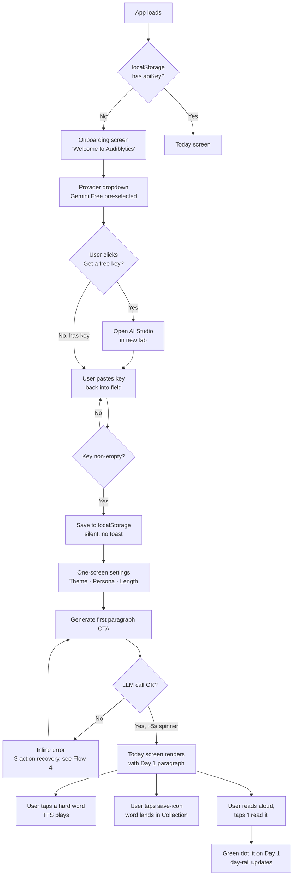
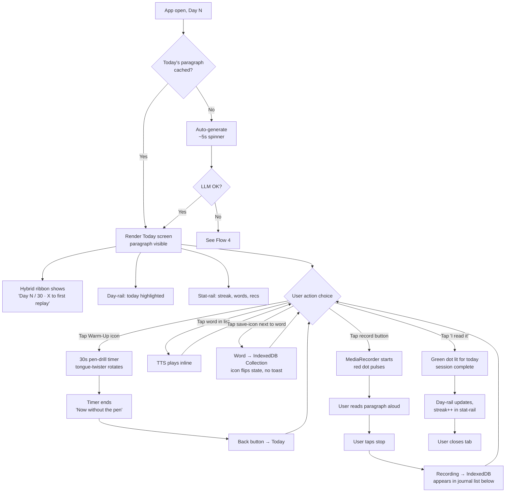
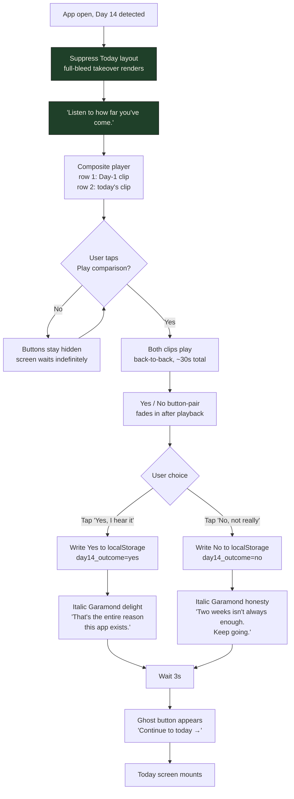
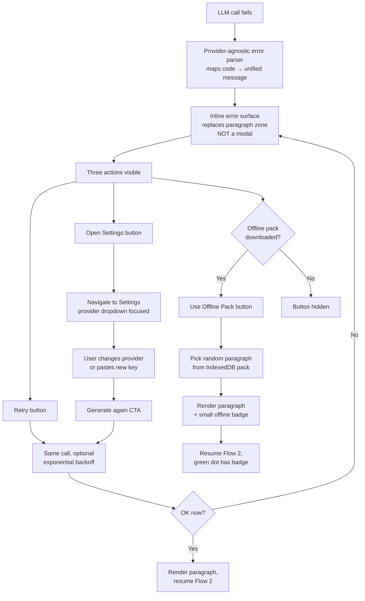
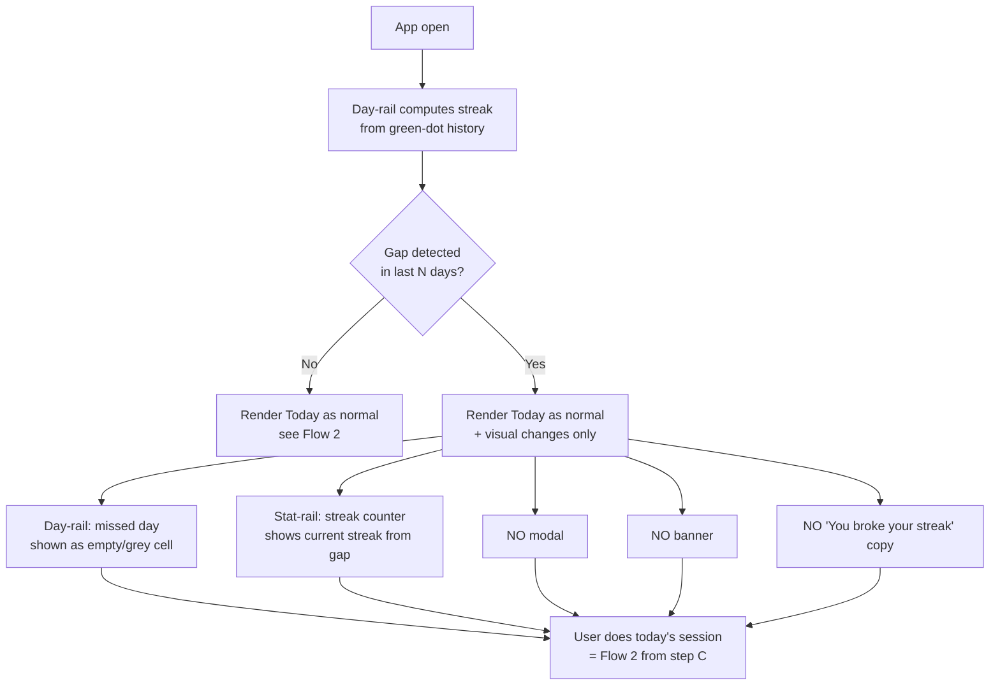

# UX Design Specification — Audiblytics

**Author:** Priyank
**Date:** 2026-05-02

---

<!-- UX design content appended sequentially through workflow steps -->

## Executive Summary

### Project Vision

Audiblytics is a calm, editorially-styled daily voice gym for a single user (Priyank). The UX exists to enable one outcome: on Day 14, the user hears recorded evidence that his pronunciation improved. Every screen, every component, every word of copy serves that 30-second comparison playback. Visually, the product borrows the editorial grammar of `ai-2027.com` — cream background, dark serif headlines, monospace data badges, sidebar timeline rail, calm metric cards, and a deliberate green/red duality reserved exclusively for the Day-14 binary self-report.

The product is fully client-side, single-tab, single-device, single-user. There is no auth surface, no empty-team state, no marketing surface. The UI can be opinionated and dense in a way mass-market apps cannot.

### Target Users

**Priyank — n=1.** Adult developer, English-fluent, technically comfortable. Has a Gemini key within 5 minutes. Uses laptop (Chrome macOS primary, Safari secondary). Has ~5 min/day, no patience for friction, no tolerance for shame-inducing UI, no interest in another subscription. Quietly hopeful one focused tool can succeed where ELSA / Anki / paragraphlearning.com left him fragmented.

The *emotional* user need: the felt sense of progress. The Day-14 audio comparison is the load-bearing emotion of the entire product — design choices defer to it.

### Key Design Challenges

1. **Editorial density vs 5-min daily ritual.** Borrow ai-2027's typographic grammar without inheriting its long-form length. Single-screen daily surface that reads unhurried but completes fast.
2. **Voice Journal as sacred artifact, not utility widget.** Record affordance must feel like the most important element on Day 14 and ambient on Day 3 — both at once.
3. **Day-14 non-dismissable takeover (FR37) must block without hostility.** Exact pattern match to ai-2027's "Choose Your Ending" full-bleed split.
4. **No-shame calendar (FR58, NFR22).** Missed days = honest empty cells. Red is reserved for Day-14 "No, not really" only — nowhere else in the product.
5. **BYO-key onboarding ≤3 min (NFR21).** Provider dropdown + paste-key must read as a content preference, not a developer setup chore.

### Design Opportunities

1. **Inherit a distinctive visual moat.** ai-2027's editorial palette (cream + serif + monospace data badges + forest-green) is recognizable and not used by any language app — instant differentiation, free.
2. **"Key Metrics" stat-card grid for daily status.** Streak, words saved, recordings made, day-of-30 — honest numbers as ambient progress, never gamified badges.
3. **Green/red duality reserved for Day-14 only.** Concentrates the entire product's emotional weight into one engineered moment, the way ai-2027 reserves dual color for its ending choice.
4. **Sticky left timeline rail = ambient day-of-30 awareness.** Mirrors ai-2027's `Mid 2025 → Oct 2027` rail; gives Audiblytics a persistent, non-nagging "where am I in the arc" affordance.
5. **Monospace IPA badges.** `/krɪˈpʌskjələr/` rendered as a typographic artifact unifies the data aesthetic with paragraph generation, hard-word glossary, and Voice Journal duration metadata.

## Core User Experience

### Defining Experience

The defining interaction is the daily ritual: open app → today's paragraph appears → read aloud → record → save 1–2 words → "I read it" → close. ≤5 minutes (NFR20). The single interaction that must be effortless above all others is **starting a recording** — from tap to active capture in <300ms (NFR3), no confirmation modal, no permission re-prompt after first session (FR32). If recording feels like work, F6 (Voice Journal) dies, and per the PRD MVP-Slip Hierarchy, F6 dying means the MVP dies. Every secondary surface (Settings, Collection browse, Daily Review, Calendar zoom) defers to that primary flow.

### Platform Strategy

- **Form factor:** Web app — Next.js 15 SPA, browser-only, no backend.
- **Primary device:** Laptop, ≥1024px viewport, mouse + keyboard input.
- **Browser tier 1:** Chrome on macOS (reference browser for all UX decisions).
- **Browser tier 2:** Safari on macOS — supported with known caveats: `SpeechSynthesis.getVoices()` returns a smaller set, `MediaRecorder` defaults to `audio/mp4` (vs Chrome's `audio/webm`); persistence layer stores actual MIME with each recording.
- **Out of scope:** Mobile (renders but no optimization), touch input, PWA install, service worker, offline shell. Offline support comes from F10 offline-pack in IndexedDB only.
- **Permissions:** Microphone via `getUserMedia` requested *only* on first record-button tap (FR32, NFR18) — never on app load.
- **Network:** Browser → user-configured LLM provider directly. HTTPS required for non-localhost deployments (NFR15).

### Effortless Interactions

These actions must require zero deliberation, single-tap or zero-tap:

1. **Returning user open → today's paragraph is already on screen** (FR19). No "Generate" tap unless it's the first session of the day or yesterday's wasn't completed.
2. **Tap to record** (FR30, NFR3) — one button, one tap, capture begins in <300ms. No "are you ready" modal, no countdown.
3. **Tap a hard-word → TTS fires** (FR22, NFR4) immediately. No menu, no playback options.
4. **Tap save icon → word lands in collection** (FR26, NFR23) — optimistic UI; no toast.
5. **Tap "I read it" → green calendar dot appears** (FR54, NFR23) — no confirmation modal.
6. **Provider switch in Settings** (FR9, NFR27) — dropdown → paste key → done. Previously entered keys are preserved (no re-entry on swap-back).

### Critical Success Moments

In priority order — failure of any of these invalidates the MVP success thesis:

1. **The Day-14 takeover.** First paint must read calm, not alarming. User taps play, hears the comparison, makes a binary choice. This is the load-bearing emotional moment of the entire product (FR37, FR38, FR39; §J3 in PRD).
2. **First successful recording (Day 1–2).** Permission grant → record → playback round-trip works. A janky first recording forfeits user trust in F6 permanently.
3. **First paragraph generation.** ≤15s end-to-end, schema-valid JSON, hard-words render with IPA + meaning + example. If this breaks on Day 1, Priyank debugs his own app instead of using it (FR12, FR17, NFR2).
4. **Day 1 onboarding ≤3 minutes.** Provider dropdown → "Get a free key" → paste → defaults → generate. Exceeding 3 min loses the friction-allergic user persona (NFR21, §J1).
5. **Day 8 missed-day return.** Honest grey dot, streak resets to 1, no accusation, no shame, normal flow resumes (§J5, FR58, NFR22).

### Experience Principles

Five principles. Every subsequent UX decision must trace to at least one.

1. **Paragraph is the hero.** Every screen defers visually to the day's paragraph. Hard-words read as footnotes, controls as marginalia, navigation as a sticky rail — not a bar. Editorial respect for the text being read aloud.

2. **Calm by default, sacred at Day 14.** 28 of 30 days the UI stays quiet — neutral palette, no animations, no pulsing buttons, no confetti. Day 14 earns its full-bleed emotional moment *because* every other day was restrained.

3. **Honest numbers, never gamified badges.** Streak, words saved, recordings made are stat-cards reading as data — not achievements. No flames, no levels, no "Streak 🔥 7." Just `7 / 30`. Mirrors ai-2027's "Key Metrics 2026" tone exactly.

4. **One tap or zero.** Frequent actions (record, save word, "I read it", play TTS, generate) are single-tap with no confirmation modal (NFR23). Multi-step flows are reserved for Settings. Day-14 is the *only* engineered friction in the product; everywhere else, friction is a bug.

5. **Compassionate by default — never shame the user.** Missed days are visually absent, not visually red (FR58). Errors offer recovery actions, never assign blame. Copy says "Welcome back," never "You broke your streak." Per NFR22.

## Desired Emotional Response

### Primary Emotional Goal

**Quiet, earned pride.** Not delight (too saccharine for the editorial voice). Not empowerment (too marketing-deck). Not mastery (too aggressive for n=1 personal use). Quiet pride is the load-bearing emotion of the entire product — what Priyank should feel on Day 14 when he hears past-self stumble through `vehement` and present-self read it cleanly. Quiet because the product is quiet; earned because it took 14 days of physical practice; pride because the evidence is in his own voice.

This single emotion is the gate. If the user does not feel quiet, earned pride at Day 14, the product has failed — regardless of feature completeness, performance, or visual polish.

### Secondary Feelings

- **Calm focus** during the 5-min daily ritual — no urgency, no notifications, no FOMO copy
- **Trust** in the data layer — API key stays local, no telemetry, no "we collect" boilerplate
- **Curiosity** about hard-words — tap-to-discover, mild dopamine without engineered addiction
- **Self-respect** — the product treats his time as valuable; ≤5 min is a promise
- **Quiet competence** — knowing his pronunciation is improving without anyone telling him so

### Emotions to Actively Avoid

| Emotion | Why we kill it | Where it would creep in |
|---|---|---|
| **Shame** | Kills retention, insults user (NFR22, FR58) | Missed-day red dots, "you broke your streak" modals |
| **Anxiety** | Wrong nervous system for daily practice | Loud timers, pulsing CTAs, score countdowns |
| **FOMO / loss-aversion** | Manipulative, betrays trust | Streak-freeze cross-sell, notification spam |
| **Manufactured excitement** | Saccharine, dishonest | Confetti, ALL-CAPS celebration, achievement unlocks, emoji explosions |
| **Dependence** | Product should serve user, not own him | Streak as primary visualization over honest data |
| **Skepticism / suspicion** | Kills BYO-key trust | Hidden network calls, opaque settings copy |
| **Boredom** | After 30 days, kills the 2nd month | Same paragraph type every day, locked themes/personas |

### Emotional Journey Mapping

1. **Day 0 onboarding (~3 min):** Curious → mildly impressed (it really is free) → committed-enough-to-try-tomorrow. Critical: must not feel like dev-tool setup.
2. **Day 1–3 (loop forming):** Mild anticipation → engaged → satisfied (took 5 min, not 20). Trust building from clean recording round-trip + remembered settings.
3. **Day 4–7 (loop working):** Quiet confidence. Mild surprise when recycled words appear (recognition without being told). Warm-up earns its weirdness — playful not silly.
4. **Day 8 (missed-day test):** Anticipated guilt → relief (UI did not catastrophize) → re-engagement. Honest grey cell, no modal, no copy referencing the gap.
5. **Day 14 (engineered climax):** Mild surprise (full-bleed takeover) → curiosity (tap play) → **emotionally moved** (audio comparison) → **quiet pride** → re-commitment. THE moment.
6. **Day 30 (gate):** Reflective satisfaction → self-report "yes, my pronunciation actually improved." Product must not insert itself — let user own the conclusion.
7. **Failure modes:** Errors trigger frustration → relief (clear recovery actions) → continued use. The app never says "something went wrong" — it says what went wrong and what to do.

### Micro-Emotions

| Polarity | Audiblytics choice | Why |
|---|---|---|
| Confidence ⟷ Confusion | **Confidence** | Every screen has one obvious next action |
| Trust ⟷ Skepticism | **Trust** | Local-only data, zero telemetry, key visibility transparent |
| Excitement ⟷ Anxiety | **Calm (neither extreme)** | Ritual energy, not adrenaline energy |
| Accomplishment ⟷ Frustration | **Earned accomplishment** | Only Day 14 + Day 30; rest of time, neutral satisfaction |
| Delight ⟷ Satisfaction | **Satisfaction (with one delight)** | One delight allowed — Day 14 banner copy after Yes-tap |
| Belonging ⟷ Isolation | **N/A — reframed as Ownership** | n=1; no social need; isolation = his data, his key, his ritual |

### Design Implications

| Emotion | UX choice that delivers it |
|---|---|
| **Quiet pride (Day 14)** | Full-bleed takeover, large serif type, calm cream bg, single play button as focal element, sequential audio comparison, binary green/red buttons, one delighted line of copy after Yes-tap |
| **Calm focus** | Cream background, no idle animations, no notification badges, no progress bars except where literally measuring, generous whitespace, single-column reading width |
| **Trust** | "Key stays in your browser — we have no servers" copy on Settings. Zero analytics. Visible in-app version + dependency list. Clear "what works offline" indicator |
| **Curiosity** | Hard-words list rendered as glossary footnotes — discoverable, not announced. Tap reveals more inline, no modal |
| **Self-respect** | Subtle footer line: `~5 min daily • $0 / mo`. Time honored by tight one-tap flows |
| **Quiet competence** | Stat cards show data without celebration. `Streak: 7 / 30` not `🔥 STREAK 7!` |
| **Anti-shame** | Missed-day cells = honest empty (light cream-grey). Streak resets silently. No "you missed yesterday" surface anywhere |
| **Anti-anxiety** | Recording timer counts up (calm) not down (urgent). Generate spinner subtle, not pulsing. No red anywhere except Day-14 No-button + provider error states |
| **Anti-FOMO** | No streak-freeze cross-sell. No "x other people" social proof (no other people exist). No notification permission ever requested |

### Emotional Design Principles

1. **Restraint earns climax.** 28 days of calm UI lets Day 14 be emotionally loud. If we celebrate every day, Day 14 lands flat.
2. **Honesty is the trust generator.** Show real data; label real costs ("$0 with Gemini free tier" — never "free forever"); never inflate. Trust compounds; betrayed trust never returns.
3. **The mouth is the protagonist, the screen is the stage.** UI exists to spotlight the physical act of speaking, not to entertain the user with itself. Visual modesty is the form of respect for the act.
4. **One delight per release, not one per session.** Day 14 banner copy is *the* allowed delight moment. Every other moment defaults to satisfaction-not-delight.
5. **Errors are conversations, not accusations.** Every error message names what happened, why, and what to do. Never "Oops, something went wrong." Always: provider name + error code + three concrete recovery actions.

## UX Pattern Analysis & Inspiration

### Inspiring Products Analysis — Sole Primary Source: ai-2027.com

User-anchored single primary visual lineage. Other patterns referenced only as reinforcing precedents (Stripe Press editorial typography, Linear's data-density restraint) — not as competing influences.

#### Pattern dissection from screenshots

**Layout grammar:** Three-column desktop. Left = sticky timeline rail (months/quarters from `Mid 2025` → `Oct 2027`). Center = paragraph content constrained to ~600–700px reading width. Right = persistent dashboard widget that updates via scrollytelling (intersection observer). Generous vertical whitespace (~80px above section headers).

**Color palette:**

| Role | Color (approx) | Where used |
|---|---|---|
| Primary surface | `#f5f0e6` cream | Page background, light cards |
| Primary ink | `#1a1a1a` near-black | Body text, headings |
| Forest green primary | `#2d5b3a` | Active state, Slowdown button, dark stat cards, dashboard accents |
| Forest green light | mint/sage | Donut fills, capability checkboxes |
| Deep red | `#8b2929` brick | Race button, race-ending color, danger |
| Muted dusty-pink | desaturated rose | Disabled "not chosen" state (Race when Slowdown is active) |
| Muted sage | desaturated green | Disabled state of Slowdown when Race is active |
| Border / divider | `#d9d2c5` warm grey | Card borders, accordion separators |

**Typography hierarchy:**

| Class | Family | Use |
|---|---|---|
| Display headline | Serif (Caslon/Garamond) | "AI 2027", section titles, "Choose Your Ending" |
| Body paragraph | Serif | All long-form essay text |
| Tab/button label | Sans-serif | "What is this?", "Slowdown", "Race" |
| Data badge | **Monospace bold** | `$1T`, `38GW`, `2.5%`, agent-copy counts |
| Sidebar timeline label | Monospace | `Mid 2025`, `Jan 2027` |
| ALL-CAPS micro-label | Sans, letter-spaced | "GLOBAL AI CAPEX", "OPENBRAIN REVENUE" |

**Stat-card variants:**

- **Light card** — cream bg, thin border, dark monospace number, ALL-CAPS sans label above
- **Dark card** — forest-green bg, white text, optional info icon top-right; reserved for *featured* metrics

**Choose Your Ending pattern** (critical Audiblytics analog for Day 14): Centered headline, two equal-width buttons side-by-side, green left + red right. Active = full saturation; not-chosen = desaturated muted version (still readable, never removed). No skip link visible.

**Other observed patterns:** Pill tabs inside bordered panel; accordion footnotes with `▶` triangle; inline meta-actions ("PDF · Listen · Watch"); dark micro-banner header on right rail showing current era; classification grid (Currently Exists / Emerging Tech / Science Fiction).

### Transferable UX Patterns

#### Navigation Patterns

| ai-2027 pattern | Audiblytics use | FR/Principle trace |
|---|---|---|
| Sticky left timeline rail | Sticky left **day-rail** (Day 1 → Day 30+); current day glows green; missed = empty cream | FR55, FR57, FR58, NFR22 |
| Persistent right dashboard | Persistent right **stat-card stack**: Streak, Words Saved, Recordings, Day of 30 | "Honest numbers" principle |
| Top-right minimal nav | Top-right minimal nav: `Today / Collection / Review / Settings` | FR7, F8, F9 |
| Dark mini-banner (`Jan 2027`) | Dark mini-banner: `Day 7 of 30` + active persona/theme chip | "Calm by default" |
| Inline meta-actions ("PDF · Listen · Watch") | Inline meta-actions: `▶ Play paragraph · ⏵ Warm-Up · ⚙ Settings` | F4, F7 |

#### Interaction Patterns

| ai-2027 pattern | Audiblytics use | FR trace |
|---|---|---|
| **Choose Your Ending** dual button (green/red, equal width, no skip) | **Day-14 binary**: `[Yes, I hear it]` / `[No, not really]` — exact pattern adoption | FR37, FR38, FR39 |
| Pill tabs inside bordered panel | **Settings sub-sections**: Provider / Defaults / Voice / Retention as pill tabs | FR1–FR8 |
| Accordion footnote (`▶`) | **Hard-words list** as expandable inline accordion (no modal) | FR2, FR18, FR26 |
| Scrollytelling dashboard updates | **Stat-card stack updates per route** — Today / Collection / Review / Calendar each show their own metrics | All metrics |
| Disabled-but-visible "not chosen" state | After Day-14 tap: chosen button stays full color, other desaturates — answer recorded, not removed | FR39 |

#### Visual Patterns

| ai-2027 pattern | Audiblytics use |
|---|---|
| Cream bg + dark serif body | Cream bg + dark serif for paragraph (the hero) |
| Monospace data badges | Monospace for **IPA** (`/krɪˈpʌskjələr/`), recording duration (`0:42`), streak (`7 / 30`), day-of (`Day 14`), provider chip |
| ALL-CAPS sans micro-labels above numbers | Stat-card headers: `STREAK`, `WORDS SAVED`, `RECORDINGS`, `DAY OF 30` |
| Light + dark card pair | Ambient stats in light cards; *one* featured metric per screen in dark forest-green card |
| Constrained reading column | Paragraph rendered ~600–700px column, never edge-to-edge |
| Editorial footnote refs (superscript) | Faint serif superscript on *new* hard-words (not recycled — Q2 default preserved) linking to glossary below |

### Anti-Patterns to Avoid

| Anti-pattern | Where it would creep in | Why kill it |
|---|---|---|
| **Loud gamification** (Duolingo: confetti, level-ups, mascots) | Streak, "I read it" success, save-word feedback | Conflicts with "calm by default", "no manufactured excitement" |
| **Score-shame UI** (ELSA: red-tinted weak labels, single-digit % scores) | Voice Journal playback, Daily Review feedback | The exact failure mode the brief explicitly named |
| **Notification badge dots** (Slack/Linear unread counts) | Top nav, Collection, Calendar | Manufactures urgency where none exists in n=1 |
| **"Streak Freeze!" cross-sell** (Duolingo) | Near calendar or streak counter | Excluded by PRD §J5; "no shame, no rescue economy" |
| **Modal confirmations on primary actions** | Save-word, "I read it", record/stop, generate | Violates NFR23 single-action primary tasks |
| **Empty-state illustrations + cheery tutorial copy** ("Save your first word 🚀") | Empty Collection, Day 1 calendar | Patronizes a user who built his own app |
| **Dashboard widget overload** (multiple gauges/sparklines competing) | Right rail | ai-2027's density is earned; Audiblytics has fewer real metrics — show fewer, larger |
| **Generic SaaS dark mode** (purple/neon-blue gradients, glass-morphism) | Anywhere | Wrong cultural register; betrays cream editorial palette |
| **Auto-playing audio** on page load | Day-14 takeover, paragraph view | Browsers block; user should *choose* to play |
| **Marketing CTAs disguised as UI** ("Try Pro for advanced features") | Anywhere | n=1, no marketing surface, no Pro |
| **Emoji clip-art icons** in UI chrome | Buttons, nav, headers | Cream + serif + monospace is the language; emoji break the lineage |
| **Toast notifications** for routine actions | Save-word, record-stop, generate-success | Optimistic UI absorbs feedback; toasts are noise |
| **"Pro tip" hover tooltips** | Onboarding, advanced settings | Trust the user; label settings clearly inline instead |

### Design Inspiration Strategy

**What to Adopt directly:**

1. Color palette — cream + near-black + forest-green + deep-red + warm-grey
2. Three-family type system — serif body/headlines + monospace data + sans buttons/labels
3. Three-column desktop layout — left day-rail, center paragraph, right stat-card stack
4. Light + dark stat-card pair (one featured metric per screen)
5. **Choose Your Ending dual-button** — pixel-borrowed for Day-14 Yes/No (FR37–FR39)
6. Pill tabs in bordered panel — Settings sub-sections
7. Accordion footnote disclosure — hard-words inline expansion
8. Constrained reading column ~600–700px — paragraph as hero
9. Monospace data badges for IPA, durations, counts, provider chips
10. ALL-CAPS letter-spaced micro-labels above numbers

**What to Adapt:**

1. Sticky timeline rail — modify to 30 numbered day-cells (extends to 60/90), green-glow current day, empty-cream missed days
2. Right-rail dashboard — reduce density to 4 cards max (Streak, Words Saved, Recordings, Day of 30) to honor "calm by default"
3. Inline meta-actions — replace "PDF · Listen · Watch" with functional verbs: `▶ Play paragraph · ⏵ Warm-Up · ⚙ Settings`
4. Scrollytelling dashboard — Audiblytics is route-based; cards swap per route, not per scroll
5. Editorial footnote refs — apply only to *new* hard-words (Q2 default: no indicator on recycled words preserves ambient-discovery)
6. Email subscribe footer block — replaced with honesty footer: `~5 min daily · $0 / mo · Provider: gemini-2.5-flash`

**What to Avoid:** entire anti-pattern list above (gamification, score-shame, badge dots, modals, emoji, toasts, marketing CTAs, dark mode).

**Style tile plan** (executed in Step 6 — Design System):

- 5 color tokens, 3 type families, 8 component primitives (button, button-pair, stat-card-light, stat-card-dark, day-cell, hard-word-glossary-row, settings-pill-tab, accordion-row)
- 4px base spacing scale: 4 / 8 / 12 / 16 / 24 / 32 / 48 / 64 / 96
- Day-14 takeover full-bleed centered layout shell

## Design System Foundation

### Design System Choice

**shadcn/ui on Tailwind 4, themed with a custom token system that locks the `ai-2027.com` editorial visual lineage.**

The technology stack is pre-locked by PRD §Implementation Considerations (Next.js 15 + TypeScript + Tailwind + shadcn/ui), so this step formalizes the *theming* discipline rather than choosing a system from scratch. shadcn/ui is the optimal foundation because it ships unopinionated Radix-based primitives that are fully restyleable via CSS variables, copy-paste-installed (no runtime dependency weight per NFR26), and inherit Radix's accessibility for free (per the NFR Accessibility section).

### Rationale for Selection

- **Constraint compatibility:** PRD-locked stack is shadcn/ui; this step does not violate that lock.
- **Visual flexibility:** shadcn primitives are unopinionated — they accept any color/type/spacing token system without fighting back. Ideal for the cream/serif/forest editorial direction.
- **Build-week budget:** copy-paste install + theme override is faster than authoring primitives from scratch (rejected option 1) or fighting Material/Ant defaults (rejected option 2).
- **Accessibility floor:** Radix gives us keyboard navigation, focus management, ARIA, and screen-reader compatibility "for free" — meeting the NFR Accessibility "best-effort by default via Radix" commitment without separate work.
- **Maintenance posture (NFR25):** custom tokens live in exactly two files (`globals.css` + `tailwind.config.ts`), making the entire visual lineage editable by Priyank-in-6-months without touching component logic.

### Implementation Approach

**Phase 1 — Token foundation (~2 hours, Day 1)**

1. Install Next.js 15 + Tailwind 4.
2. Add Google Fonts via `next/font`: **EB Garamond** (serif, body + headlines), **Inter** (sans, buttons + labels + ALL-CAPS micro-labels), **JetBrains Mono** (mono, all data badges including IPA — ligatures disabled).
3. Author `globals.css` with the full color + type + spacing + radii token set (see token specs below).
4. Configure `tailwind.config.ts` with extended colors mapped to CSS variables, font families, custom radii.

**Phase 2 — shadcn install + theme override (~1 hour, Day 1)**

1. `npx shadcn@latest init` — accept defaults, then edit `components.json` to point at our token names.
2. `npx shadcn@latest add button select input label slider switch dialog tabs collapsible tooltip`.
3. Edit each generated component: replace hardcoded slate/zinc with our tokens, swap `rounded-md` → `rounded-sm`, add `forest` / `brick` variants where needed.

**Phase 3 — Custom primitives (~4 hours, Day 1–2)**

Build the 8 Audiblytics-specific primitives in `src/components/ui/`:

1. `ButtonPair` (Day-14 binary)
2. `StatCardLight` (ambient metrics)
3. `StatCardDark` (one featured metric per screen)
4. `DayCell` (calendar cell with completed/empty/today/offline-pack states)
5. `HardWordRow` (collapsible glossary row)
6. `SettingsPillTab` (pill tabs inside bordered panel)
7. `AccordionRow` (▶ triangle accordion)
8. `DayRail` (sticky 30-day numbered timeline rail)

Render all variants on a Priyank-only `/_dev/components` route for visual verification (removed before any public deploy).

**Phase 4 — Theme verification (~30 min, Day 2)**

Side-by-side comparison of `/_dev/components` against ai-2027 screenshots for color/type/spacing fidelity. Lock tokens after this — no further edits during build week unless something visibly breaks.

### Customization Strategy

**Concrete tokens (locked):**

```css
:root {
  /* Surface */
  --cream: #f5f0e6;          /* page background */
  --cream-dim: #ebe5d6;      /* elevated surface */
  --border: #d9d2c5;         /* warm grey divider */

  /* Ink */
  --ink: #1a1a1a;            /* body text */
  --ink-soft: #4a4a4a;       /* secondary text */
  --ink-faint: #8a8580;      /* tertiary, micro-labels */

  /* Primary */
  --forest: #2d5b3a;         /* primary accent, Day-14 Yes */
  --forest-deep: #1f4029;    /* hover */
  --forest-light: #6b9b7b;   /* sage accents */
  --forest-faint: #d4e0d8;   /* today's day-cell glow */

  /* Danger — restraint-locked */
  --brick: #8b2929;          /* Day-14 No, errors only */
  --brick-deep: #6e1f1f;     /* hover */

  /* Disabled / not-chosen states */
  --sage-dim: #91a89a;
  --rose-dim: #b89090;
}
```

**Token usage discipline:**

- `--brick` appears in exactly two places: the Day-14 "No, not really" button and provider/network error surfaces (FR11, FR42). Nowhere else, ever.
- `--forest` is the *only* primary accent. No secondary brand colors.
- No gradients, no shadows. Borders only (`1px solid var(--border)`).
- No `rounded-full`, no pill-shaped buttons.

**Type stack:**

| Family | Source | Use | Notes |
|---|---|---|---|
| EB Garamond | Google Fonts | Body paragraphs, headings, paragraph hero | Full IPA Unicode coverage |
| Inter | Google Fonts (shadcn default) | Buttons, nav, form inputs, ALL-CAPS micro-labels (`tracking-wider`) | Default shadcn already loads it |
| JetBrains Mono | Google Fonts | IPA, durations, day counts, provider chips, all data badges | Ligatures **disabled** — IPA must not ligate |

**Type scale:** Tailwind defaults (xs/sm/base/lg/xl/2xl/3xl/5xl/7xl) — paragraph body uses `text-xl` (20px) at line-height 1.7 for read-aloud rhythm.

**Spacing scale:** Tailwind default 4px base. Reading column max-width `640px`. Stat-card grid gap `12px`.

**Radii:** sm 4px / md 6px / lg 8px. Squarer than shadcn defaults to honor editorial register.

**Component customization map:**

| Audiblytics primitive | shadcn source | Customization |
|---|---|---|
| `Button` | `Button` | New `forest` + `brick` + `outline` + `ghost` variants; `rounded-sm` |
| `ButtonPair` | Custom + 2× `Button` | Equal-width `grid-cols-2`; supports active vs muted-not-chosen state |
| `StatCardLight` | Custom (composition) | Cream bg, warm-grey border, mono number + ALL-CAPS sans label |
| `StatCardDark` | Custom variant | Forest fill, cream text |
| `DayCell` | Custom | 32×32 sq, states: empty / completed / today / offline-pack |
| `HardWordRow` | `Collapsible` + custom | Inline glossary row with chevron expand |
| `SettingsPillTab` | `Tabs` | Pill triggers in bordered panel |
| `AccordionRow` | `Collapsible` | `▶` triangle marker, editorial styling |

**Components explicitly NOT used:** `Toast`, `Badge`, `Avatar`, `Sheet`, `Drawer`, `Command`, `Popover`, `Menubar` — all anti-pattern or unnecessary for n=1 surface.

**Long-term maintenance:** All visual identity lives in two files (`globals.css` + `tailwind.config.ts`). Future visual revisions edit those two files only; component code remains structural. Honors NFR25 (code legibility for return-after-6-months).

## Defining Experience

### The Defining Interaction

Audiblytics' defining experience is structurally a **pair**:

1. **Daily defining interaction (Days 1–30):** Tap a single button to record yourself reading today's paragraph. Tap again to stop. The recording is permanent.
2. **Climactic defining interaction (Day 14, fires once):** Tap one play button. Hear your own voice from Day 1, then today, side-by-side. Tap `[Yes, I hear it]` (forest) or `[No, not really]` (brick).

If the daily interaction (#1) is engineered correctly thirteen times in a row, the climactic interaction (#2) earns its emotional payoff. If #1 is janky or unreliable, #2 has nothing to play. So #1 is what we *engineer for* and #2 is what we *deliver toward*.

**One-sentence summary:** *Single-tap audio capture during reading, persisted permanently, replayable side-by-side weeks later.*

This is the interaction Priyank will describe to a friend: not "I use a vocab app," but "I record myself reading every day and listen back."

### User Mental Model

**Familiar models the user brings to the interaction:**

| Source | Brings |
|---|---|
| Voice Memos / system Recorder | Tap big circle to record, tap again to stop, recording auto-saves to a list |
| Reading aloud (any context) | Eyes → mouth → ears feedback loop; eye naturally anchors on harder words |
| ChatGPT / paragraph generators | "Generate" verb is familiar; loading state acceptable up to ~15s |
| Anki / Quizlet | Save → review later → flip card metaphor |
| Notes apps with TTS | Tap word → hear pronunciation |

**Novel mechanics — and how they self-teach:**

| Novel mechanic | Why no model fits | How user learns it |
|---|---|---|
| Recording oneself reading aloud as a daily ritual (not a one-off note) | Voice Memos are episodic; voice journaling for self-improvement has no mass-market precedent | The mechanic itself is mundane (familiar record button); the framing reveals itself at Day 14 |
| Side-by-side past-vs-present voice comparison | Music DJs "A/B compare" but no language app does this | Day-14 takeover *is* the explanation; the user experiences it for the first time with full surprise |
| Day-14 non-dismissable takeover | Onboarding tours and paywalls are familiar; this is neither | Banner copy ("Listen to how far you've come") + single play button + binary buttons — self-explanatory, zero tutorial |

**Likely confusion points + their resolution:**

1. *"Did it start recording?"* — Solved by visible state change (button color shift + record-to-stop symbol swap) and immediate count-up timer (`0:00 → 0:01...`).
2. *"Where did the recording go?"* — Solved by inline materialization of the clip directly below the record button as `▶ 0:42 · today 1:42pm`. No navigation, no modal.
3. *"Why am I doing this?"* (Days 2–13) — Solved by stat-card showing `Recordings: 3 / 14 to first replay` — builds anticipation without spoiling the takeover.
4. *"What's happening on Day 14?"* — Solved by calm takeover copy; no startle, no alarm, no explanation prose required.

### Success Criteria

**Session-level (engineered into the daily mechanic):**

- Tap-to-active recording latency **<300ms** (NFR3)
- **Zero silent recording loss** — every stop-tap results in persisted IndexedDB entry (NFR8, FR42)
- **Inline playback works first try** — no page navigation, no modal
- **Day-14 trigger fires exactly once** on user's 14th distinct day of use, never before, never twice (NFR12)

**Product-level (validated by user):**

- Day-14 binary self-report = `Yes, I hear it` (FR39, leading indicator)
- Day-30 self-report = "my pronunciation actually improved" (PRD §Success Criteria, the gate)

**Observed user signals if working correctly:**

- "It just started — I didn't have to fiddle with anything"
- "I can see it's recording without thinking about it"
- "Stopping was as easy as starting"
- "My recording is right there — I can tap to play it back"
- "It's saved — I don't have to think about it"
- (Day 14) "I understand what just happened — and I want to hear it again"

### Novel UX Patterns

The defining interaction is a **familiar mechanic in a novel context**. Almost every individual control is established; the novelty is in the combination and emotional engineering, not in the interactions themselves.

| Layer | Pattern | Familiarity |
|---|---|---|
| Record / stop button | Apple Voice Memos | Established — adopt directly |
| Inline playback list below controls | Voice Memos | Established — adopt directly |
| Tap-to-pronounce hard-words | Anki + dictionary apps | Established |
| Save-to-collection icon | Bookmark / pin metaphor | Established |
| Side-by-side voice comparison player | DJ A/B + Apple Memories | Adapted — sequential, not crossfade |
| Day-14 non-dismissable takeover with binary self-report | ai-2027 "Choose Your Ending" applied to personal-progress | Novel combination — proven pattern, novel emotional purpose |
| Recording as evidence of physical-skill improvement | No mass-market analog | Fully novel — but invisible; the framing reveals itself at Day 14 |

**No standalone user education required.** The Day-14 takeover self-teaches via banner copy. Daily mechanics map to existing models the user already has.

### Experience Mechanics

#### A. Daily Recording Mechanic (the engine — Days 1–30)

**1. Initiation**

- Record button positioned below paragraph, slightly right (right-handed mouse anchor): 56×56 forest-green filled circle with white record-symbol
- Mono caption above: `Tap to record this read`
- Keyboard shortcut: `R` (low-cost; supports NFR Accessibility keyboard-equivalent commitment)

**2. Interaction**

- Tap → recording state in <300ms (NFR3):
  - Bg shifts `--forest` → `--forest-deep`
  - Symbol swaps to white square (stop)
  - Subtle 1.0s breathing `box-shadow` pulse — **the only idle animation in the product** outside of focus rings
  - Adjacent mono counter starts: `0:00 → 0:01 → 0:02...`
- User reads paragraph aloud
- Tap → idle state restored
  - Counter freezes at final duration (`0:42`)
  - Clip materializes inline below as `▶ 0:42 · today 1:42pm`
  - List grows downward; newest at top

**3. Feedback**

- Primary: button state change (instant, clear)
- Secondary: count-up timer (literal proof of capture)
- No audio beep (would interrupt the read), no haptics (browser)

**4. Completion**

- Recording persisted to IndexedDB synchronously on stop (FR31)
- Calendar day-cell turns forest-green if this is the first session-completion event (FR53, FR54)
- Right-rail stat-card "Recordings" increments
- User can replay immediately by tapping clip's `▶`

**Failure handling:**

- Mic permission denied (FR33, NFR11): inline message replaces record button — *"Microphone access is required to record. Click the lock icon in your address bar, then try again."* + `[Try Again]`. Rest of app unaffected.
- IndexedDB write failure (FR42, NFR8): inline error — *"Couldn't save recording — `QuotaExceededError`. Check Settings → Voice Journal Retention."* + `[Open Settings]` + `[Try Again]`. Audio blob held in memory until resolved.
- Tab closed mid-recording: recording lost (browser limitation). Documented; no in-app warning for v1 (n=1 user knows).

#### B. Day-14 Climactic Mechanic (the payoff — fires once)

**1. Initiation**

- Triggered on app open if `daysOfUse === 14 && !day14PromptFired` (FR37, NFR12)
- Trigger uses *distinct days of use*, not calendar days
- Fires *before* the daily-paragraph route renders (root-layout effect short-circuits route)

**2. Interaction**

- Full-bleed `--cream` background; nothing behind (no modal overlay)
- Centered serif headline: **"Listen to how far you've come"** (text-5xl, EB Garamond, line-height 1.2)
- Subhead caption (mono): `Day 14 · 2026-05-15` (text-sm, ink-soft)
- Composite player:
  - Two clip rows: earliest available + most recent (FR38: tries to match on same hard-word; falls back to whole-paragraph)
  - Single large play button: `▶ Play comparison` (text-xl, 64×64)
  - Tap plays Day-1 clip → 1s silence → Day-14 clip
- Binary buttons **hidden until first playback completes** (engineered to force the listen):
  - `ButtonPair`: `[Yes, I hear it]` (forest) / `[No, not really]` (brick), equal width ~200px, side-by-side, centered
- **No close button. No `Esc` handler. No skip link. No backdrop dismiss.** (FR37 — exact PRD requirement.)

**3. Feedback**

- Pre-playback: only play button interactive
- During playback: play button → `⏸ Pause comparison` + static (non-animated) progress bar
- Post-playback: binary buttons fade in (opacity 0→1 over 200ms — the *one* fade animation in the product)
- On `Yes`-tap: brick button desaturates to `--rose-dim`; forest stays full; copy fades in: *"That's the entire reason this app exists. Keep going."* (text-base, EB Garamond, ink-soft, italic) — this is the **one allowed delight moment per release**
- On `No`-tap: forest button desaturates to `--sage-dim`; brick stays full; copy fades in: *"Recordings are saved. Try the comparison again any time from the Voice Journal."*
- After 3s, inline `[Continue to today's paragraph]` ghost-button appears bottom-right

**4. Completion**

- User taps `[Continue to today's paragraph]`
- `localStorage`: `day14Result: 'yes' | 'no'` (FR39); `day14PromptFired: true` (FR40)
- Today's paragraph renders normally
- Prompt does not fire again until Day 30 (Q1 PRD default; revisit during build week)

**Failure handling:**

- No earliest recording exists (user never recorded before Day 14): takeover does not fire; soft inline banner on home — *"You haven't recorded yet. Try a recording today — your future self wants to hear it."* with `[Show me how]` link. Day-14 trigger re-evaluates on next app open.
- Hard-word match fails (FR38 fallback): player shows whole-paragraph comparison; caption notes `Earliest paragraph · today's paragraph`.
- Audio playback fails (permission revoked, blob corruption): error surface *within the dialog* with retry. Critical: do *not* dismiss the dialog on error — that would give the user an escape hatch they shouldn't have.

## Visual Design Foundation

### Color System

The raw color tokens are locked in §Design System Foundation. This section maps them to **semantic intents** so component code references purpose (`bg-primary`) rather than literal color (`bg-forest`).

```css
:root {
  --surface: var(--cream);
  --surface-elevated: var(--cream-dim);
  --divider: var(--border);

  --text-primary: var(--ink);
  --text-secondary: var(--ink-soft);
  --text-tertiary: var(--ink-faint);
  --text-on-primary: var(--cream);
  --text-on-danger: var(--cream);

  --primary: var(--forest);
  --primary-hover: var(--forest-deep);
  --primary-soft: var(--forest-faint);
  --accent: var(--forest-light);

  --danger: var(--brick);
  --danger-hover: var(--brick-deep);

  --state-disabled: var(--ink-faint);
  --state-disabled-bg: var(--cream-dim);
  --state-not-chosen-primary: var(--sage-dim);
  --state-not-chosen-danger: var(--rose-dim);

  --focus-ring: var(--forest);
}
```

**Semantic usage rules:**

| Role | Where it appears | Where it does *not* appear |
|---|---|---|
| `primary` | Record, Generate, "I read it", today's day-cell, active nav, Day-14 Yes, dark stat-card, capability indicators | Decorative — `primary` is reserved for *actionable* surfaces |
| `danger` | Day-14 No, provider errors (FR11), IndexedDB write errors (FR42) | Streak-broken, missed day, save-failed — neutral, not danger |
| `accent` | Sage chart fills, capability checkmarks, optional badges | CTAs (use `primary`) |
| `state-not-chosen-*` | Only after Day-14 binary tap | Anywhere else — Day-14-only visual idiom |

**Deliberately undefined:** `success`, `warning`, `info`. Audiblytics has no use case in n=1 surface; defining invites misuse.

#### WCAG AA Contrast Verification

| Pair | Ratio | WCAG AA |
|---|---|---|
| `--ink` on `--cream` | ~16.5:1 | ✅ AAA |
| `--ink-soft` on `--cream` | ~9.0:1 | ✅ AAA |
| `--ink-faint` on `--cream` | ~3.6:1 | ✅ AA large only — used only ≥18px or bold ≥14px |
| `--cream` on `--forest` | ~7.2:1 | ✅ AAA |
| `--cream` on `--brick` | ~6.5:1 | ✅ AAA |
| `--cream` on `--forest-deep` (hover) | ~9.5:1 | ✅ AAA |
| `--ink` on `--cream-dim` | ~14.8:1 | ✅ AAA |
| `--cream` on `--sage-dim` (not-chosen) | ~2.4:1 | ❌ — intentional, button no longer actionable post-Day-14 |
| `--cream` on `--rose-dim` (not-chosen) | ~2.6:1 | ❌ — intentional, same case |
| `--forest` focus ring on `--cream` | ~7.2:1 | ✅ AAA |

Two failing pairs apply only to non-interactive *not-chosen* state of the Day-14 binary post-selection (record-keeping role). Per PRD NFR Accessibility "best-effort by default," documented and accepted.

### Typography System

Three families locked in §Design System Foundation: **EB Garamond** (serif), **Inter** (sans), **JetBrains Mono** (mono — ligatures off for IPA). Semantic hierarchy:

| Class | Size / line-height | Family / weight | Use |
|---|---|---|---|
| `text-display` | text-7xl (4.5rem) / 1.1 | Garamond / 400 | Stat-card mega-numbers (`Day 14`) |
| `text-headline-1` | text-5xl (3rem) / 1.2 | Garamond / 400 | Day-14 takeover headline |
| `text-headline-2` | text-3xl (1.875rem) / 1.3 | Garamond / 400 | Page titles |
| `text-headline-3` | text-2xl (1.5rem) / 1.3 | Garamond / 400 | Section headings |
| **`text-paragraph-hero`** | **text-xl (1.25rem) / 1.7** | **Garamond / 400** | **Day's paragraph — the hero** |
| `text-body` | text-base / 1.5 | Garamond / 400 | Settings copy, modal body |
| `text-ui` | text-base / 1.4 | Inter / 500 | Button labels, nav links, form labels |
| `text-ui-sm` | text-sm / 1.4 | Inter / 500 | Secondary buttons, tab labels |
| `text-caption` | text-sm / 1.4 | Inter / 400 | Captions, timestamps |
| `text-micro-label` | text-xs / 1 | **Inter / 600 / tracking-wider / uppercase** | ALL-CAPS micro-labels above stat numbers |
| `text-data` | text-sm / 1.2 | **JetBrains Mono / 500** | Inline data badges, IPA, durations, day counts, provider chips |
| `text-data-large` | text-7xl / 1 | JetBrains Mono / 700 | Mega-numbers in stat-card-dark |
| `text-rail` | text-xs / 1 | JetBrains Mono / 400 | Sticky day-rail labels |
| `text-footnote` | text-xs (superscript) | Garamond / 400 | Editorial footnote refs on new hard-words |

**Pairing rationale:**

- **Garamond** for everything meant *to be read* — paragraphs, headings, body
- **Inter** for everything meant *to be acted on* — buttons, labels
- **Mono** for everything meant to read as *data* — IPA, counts, timestamps

**No mixing.** Each element uses exactly one family.

### Spacing & Layout Foundation

#### Spacing scale

4px base (Tailwind-compatible): `4 / 8 / 12 / 16 / 24 / 32 / 48 / 64 / 96 / 128`.

| Use | Token |
|---|---|
| Tight inline (icon ↔ label) | `gap-2` (8px) |
| Card internal padding | `p-4` to `p-6` (16–24px) |
| Stat-card grid gap | `gap-3` (12px) — mirrors ai-2027 KEY METRICS density |
| Section vertical rhythm | `mb-8` to `mb-12` (32–48px) |
| Page-level vertical rhythm | `mb-16` to `mb-24` (64–96px) |
| Page horizontal padding (≥1024px) | `px-12` (48px) |
| Page horizontal padding (768–1023px) | `px-6` (24px) |

#### Layout grid — three-column desktop

```
┌──────────────────────────────────────────────────────────────────────┐
│  Top nav (top-right): Today · Collection · Review · Settings         │
├──────────┬─────────────────────────────────────────┬─────────────────┤
│ Day-rail │  CENTER COLUMN                           │ Right rail      │
│ (sticky) │  max-w-[640px] · centered                │ (sticky)        │
│ w-20     │                                          │ w-72            │
│ (80px)   │  Page title (text-headline-2)            │                 │
│          │  Subhead (text-caption mono)             │ Stat-card-dark  │
│ Day 1    │  ── divider ──                           │ "Day 7 of 30"   │
│ Day 2    │                                          │                 │
│ Day 3 ●  │  Today's paragraph (text-paragraph-hero) │ Stat-card-light │
│   ...    │  ~600px max, lh 1.7                      │ "Streak"        │
│ Day 30   │                                          │ Stat-card-light │
│          │  Hard-words list (HardWordRow)           │ "Words Saved"   │
│          │  Record + playback list                  │ Stat-card-light │
│          │                                          │ "Recordings"    │
│          │                                          │ Provider chip   │
├──────────┴─────────────────────────────────────────┴─────────────────┤
│  Footer: ~5 min daily · $0 / mo · gemini-2.5-flash                   │
└──────────────────────────────────────────────────────────────────────┘
```

| Region | Width | Behavior |
|---|---|---|
| Day-rail (left) | `w-20` (80px) | `position: sticky; top: 0` |
| Content (center) | `flex-1` + `max-w-[640px]` `mx-auto` within column | Fluid, capped |
| Right rail | `w-72` (288px) | `position: sticky; top: 0` |

**Below 1024px** (Safari secondary, graceful-degradation only): day-rail → horizontal scroll strip pinned to top; right rail → stacked below content; center → full width capped at 640px.

#### Visual rhythm rules

1. **Vertical rhythm = 8px baseline.** All section spacing snaps to multiples of 8.
2. **Reading column never exceeds 640px** — even on 4K displays.
3. **Cards never have more than 8 visible elements** — split if needed.
4. **One featured (dark) stat-card per screen, max** — honors "restraint earns climax."
5. **No element floats over content unless it is the Day-14 takeover.** No sticky headers beyond top nav, no FABs, no scroll-triggered banners.
6. **Whitespace is structural.** Removing whitespace removes structure.

### Iconography

**Library:** [Lucide](https://lucide.dev) (shadcn default). Stroke-based, geometric, fits editorial register.

**Rules:**

- Stroke-width: 1.5 (slightly thinner than default — more editorial)
- Color: `currentColor` always
- Sizes: `w-4 h-4` inline, `w-5 h-5` in buttons, `w-6 h-6` in stat cards
- Every icon names an action or state — no decorative icons

**Reserved icons (only ones used in MVP):** `Mic`/`Square`, `Play`/`Pause`, `Volume2`, `Bookmark`/`BookmarkCheck`, `Trash2`, `RefreshCw`, `Settings`, `ChevronRight`/`ChevronDown`, `AlertCircle`, `Info`.

**Forbidden:** emoji in UI chrome, filled/duotone variants, custom SVG, animated icons.

### Accessibility Considerations

Per PRD NFR Accessibility — "best-effort by default; no formal WCAG audit":

| Concern | Approach |
|---|---|
| Color contrast | WCAG AA verified above; two intentional exceptions on Day-14 not-chosen state documented |
| Keyboard navigation | Inherited from Radix primitives; explicit `R` shortcut for record |
| Focus indicators | `focus-visible:ring-2 ring-offset-2 ring-forest`; never removed |
| Text scaling | All sizes in `rem`; respects browser + OS scaling |
| Screen reader | Semantic HTML; Radix ARIA; record button has state-aware `aria-label` |
| Motion sensitivity | Single idle animation (record-pulse) honors `prefers-reduced-motion: reduce` — pulse becomes static color shift |
| Mic permission denial | Inline keyboard-navigable error + retry; never modal-trapped |

**Out of scope (PRD-confirmed):** NVDA/JAWS/VoiceOver formal testing, WCAG audit report, high-contrast mode, TTS captions, reduced-motion beyond shadcn defaults, i18n/l10n/RTL.

If Audiblytics transitions to public scope, every out-of-scope item becomes required — the foundation above is already AA-compliant in practice, not retroactively.

## Design Direction Decision

### Design Directions Explored

Four full-screen mockup variations were explored, all within the locked `ai-2027.com` visual lineage (same color palette, type stack, component grammar — different layout densities and visual hierarchies). The complete interactive showcase is at `_bmad-output/planning-artifacts/ux-design-directions.html`.

| # | Name | Visual hero | Key trait |
|---|---|---|---|
| **A** | Editorial Newspaper | Paragraph (text) | Strictest ai-2027 fidelity — 3-column layout (sticky day-rail + paragraph + stat-rail). Most editorial-essay-like. |
| **B** | Recording-Forward | Record button | F6-first. Forest-green hero band promotes recording to dominant affordance. |
| **C** | Stat-Dashboard First | KEY METRICS grid | Mirrors ai-2027's KEY METRICS 2026 pattern. Single column, metrics promoted to top. |
| **D** | Single-Column Focus | Paragraph | iA-Writer-like. No rails. Reading-first. |

Each direction was rendered as a working HTML mockup with both the today's-paragraph screen and the Day-14 takeover, plus a notes panel (Strengths / Trade-offs / Best for) and a side-by-side comparison table at the bottom of the showcase.

### Chosen Direction

**Direction A — Editorial Newspaper, with one hybrid touch from Direction C.**

**Hybrid touch:** the `Day 7 / 30 · 7 to first replay` *progress copy* from C is promoted into a thin inline ribbon above the paragraph in the center column. The full 4-card KEY METRICS hero from C is **not** imported — only that single anticipation-building line.

**Resulting layout:**

```
┌──────────────────────────────────────────────────────────────────────┐
│  Top nav (top-right): Today · Collection · Review · Settings         │
├──────────┬─────────────────────────────────────────┬─────────────────┤
│          │  Today                                   │ Stat-card-dark  │
│ Day-rail │  Day 7 · Adventure · Storyteller         │ "Day 7 of 30"   │
│ (sticky) │                                          │ "7 to first     │
│ vertical │  ── divider ──                           │  replay"        │
│ Day 1 ●  │                                          │                 │
│   ...    │  ▶ Play · ⏵ Warm-Up · ↻ Generate       │ Stat-card-light │
│ Day 7    │                                          │ Streak · 2 days │
│ today    │  ━━ Day 7/30 · 7 to first replay ━━     │                 │
│   ...    │  ← HYBRID RIBBON FROM DIRECTION C        │ Stat-card-light │
│ Day 30   │                                          │ Words · 14      │
│          │  Today's paragraph (the hero)            │                 │
│          │  EB Garamond text-xl · lh 1.7 · 640px    │ Stat-card-light │
│          │                                          │ Recordings · 9  │
│          │  Hard Words list (HardWordRow)           │                 │
│          │  Record + voice-journal panel            │ Provider chip   │
│          │  "I read it →"                           │ gemini-2.5-flash│
├──────────┴─────────────────────────────────────────┴─────────────────┤
│  Footer: ~5 min daily · $0 / mo · gemini-2.5-flash                   │
└──────────────────────────────────────────────────────────────────────┘
```

The hybrid ribbon sits visually as a subtle horizontal divider with mono micro-text — `━━ DAY 7 / 30 · 7 to first replay ━━`. It does not compete with the paragraph for hero status; it functions as a **progress watermark** that builds Day-14 anticipation without spoiling the takeover.

### Design Rationale

1. **Direction A wins on visual lineage fidelity.** It is the strictest interpretation of ai-2027's editorial 3-column structure — the very pattern the user explicitly anchored on. Choosing A respects the source-of-truth constraint Step 5 locked.

2. **Direction A wins on emotional principles.** "Paragraph is the hero" (Experience Principle #1) and "Calm by default" (Emotional Principle #1) both demand that the paragraph occupy uncontested visual primacy. A delivers this; B compromises it with the forest record band; C buries the paragraph below the metrics grid.

3. **Direction B was rejected despite the F6-defining argument.** PRD F6-defining priority is a *build* and *scope* commitment, not a *visual* commitment. The recording mechanic being important does not require it to be visually loud — the daily ritual happens whether the button is 56px or 88px, and the larger button risks reading as "video meeting widget" rather than editorial reading tool.

4. **Direction C was rejected despite the strong ai-2027 quote.** Promoting the KEY METRICS grid to hero conflicts with the "calm by default" + "honest numbers, never gamified" principles. Stats *should* be present and glanceable (right rail does that); they should not be the first thing the eye lands on. The ai-2027 KEY METRICS pattern is best honored via the small dark stat-card on the right rail (already in Direction A), not via a 4-card hero grid.

5. **Direction D was rejected for losing the most distinctive ai-2027 signature.** Stripping the rails removes the visual moat. Even with identical tokens, a single-column layout looks like a generic clean blog rather than purpose-built tool. The day-rail in particular carries semantic weight (ambient progress) that a thin top strip cannot match — vertical orientation reads as a *journey through time*, horizontal reads as a *progress bar*.

6. **The C → A hybrid solves a real problem.** Direction C's "7 to first replay" copy is the *one* element from C worth importing because it solves the Day 2–13 motivation gap (PRD §J3 + the brief's anticipation-building thesis). Without it, Days 2–13 lack a forward-pointing signal toward the Day-14 climax. With it (in subtle ribbon form, not full grid), the user gets a quiet daily progress signal without spoiling the takeover.

7. **Cumulative trace to spec:** Direction A + C-ribbon honors Experience Principles 1, 2, 3 from Step 3; Emotional Principles 1, 2, 3 from Step 4; Pattern Adoption #1, #2, #3, #5, #9 from Step 5; the 3-column grid from Step 8.

### Implementation Approach

**Phase 1 — Page shell (Day 2 of build week, ~3 hours)**

1. Build the root layout in `app/layout.tsx`:
   - Top nav row (cream bg, ink text, sans-serif)
   - 3-column grid: `grid-cols-[80px_1fr_288px]` on `≥lg:` (1024px breakpoint), stacked on smaller
   - Honesty footer
2. Build the sticky `<DayRail>` component (vertical 30-cell list with `position: sticky; top: 0`)
3. Build the sticky right rail container (mounts the stat cards per route)
4. Verify against mockup pixel-by-pixel on `/_dev/components` route

**Phase 2 — Today screen (Day 2, ~4 hours)**

1. Page title row + meta-actions row
2. **The hybrid C-ribbon** — a thin divider component above the paragraph: horizontal rule with centered mono micro-text
3. Paragraph hero rendering (max-w-640, EB Garamond text-xl, line-height 1.7)
4. Hard-words list (HardWordRow primitives)
5. Record panel + voice-journal recordings list
6. "I read it →" footer

**Phase 3 — Stat cards in right rail (Day 2, ~1 hour)**

1. One `StatCardDark` for "Day of 30" (the featured metric per screen)
2. Three `StatCardLight` for Streak / Words Saved / Recordings
3. Provider chip below

**Phase 4 — Day-14 takeover (Day 4 of build week, ~3 hours)**

1. Full-bleed dialog component (no overlay, no close, no Esc)
2. Composite player with two clip rows + single play-comparison button
3. ButtonPair binary (forest Yes / brick No), hidden until first playback completes
4. Post-tap delight copy (italic Garamond) + ghost continue button after 3s

**Other screens** (Collection, Review, Settings, Calendar) inherit the same 3-column shell. Right rail stat cards swap content per route. Center column changes content; layout shell stays put. This is the "scrollytelling becomes route-based" adaptation called out in Step 5.

## User Journey Flows

> **Scope note:** Five UI flows below. J6 (offline-pack build) is a Node CLI script with no UI surface and is intentionally absent. All flows assume the Direction A layout shell from §Design Direction Decision.

### Flow 1 — First-Time Setup (J1)

**Entry:** User loads `localhost:3000` for the first time. App detects empty `localStorage` → routes to onboarding instead of Today.

**Success criterion:** First green dot lit within 3 minutes of cold start.



**Decision points & UX rules:**

- **Provider default** — Gemini pre-selected. Helper line: *"Free tier — no payment required."* User can switch but doesn't have to think.
- **Key validation** — "non-empty" only. No live API ping. PRD FR2.
- **Settings panel on first run** — Theme/Persona/Length on one screen, not a wizard. Single Generate CTA at the bottom.
- **No success modals** — first paragraph appearing IS the success state. No "You're all set!" interstitial.

---

### Flow 2 — Daily Happy Path (J2)

**Entry:** User opens app on Day N (where 1 < N < 14, or N > 14). `localStorage` has key + settings. Today's paragraph already cached or generated on open.

**Success criterion:** Session complete in ~5 min including warm-up; one new word saved; one recording captured.



**Decision points & UX rules:**

- **Warm-up is opt-in, never blocking.** User can record without warm-up. PRD FR7.
- **Recording auto-marks day complete.** Tap "I read it" or recording-stop both close the day. PRD §Capability cluster.
- **Save-to-Collection is single-tap, no confirm.** Icon state-flip is the only feedback.
- **No mid-session route changes implied.** User can navigate to Collection / Review / Settings anytime, but the daily loop is designed to flow top-to-bottom in the center column.

---

### Flow 3 — Day-14 Aha Moment (J3)

**Entry:** App open detects `dayCount === 14` (counted as distinct days-of-use, not calendar days, not session count — PRD FR36). Today screen layout is **suppressed**; full-bleed takeover renders instead.

**Success criterion:** User taps Yes or No (binary, mandatory). Today's paragraph appears only after.



**Decision points & UX rules:**

- **No Esc key handler. No close button. No overlay click-out.** PRD FR37 + Step 7 finalized.
- **Buttons hidden until first playback completes.** Prevents the user from tapping through without hearing the comparison — the whole point.
- **Edge case: missing recordings.** If no Day-1 recording exists (user skipped recording on Day 1), the takeover *still* fires but the player rows show: row 1 = "earliest available recording", row 2 = "today's reading or earliest paragraph TTS". Comparison fidelity gracefully degrades; the prompt does not. PRD §J3 capability.
- **Re-trigger:** does not fire again until Day 30 (or next milestone — PRD §Open Decisions Q1, deferred).
- **Persistence-then-flow:** the `localStorage` write happens *before* the celebratory copy renders, so a tab-close mid-celebration still records the outcome.

---

### Flow 4 — Provider Failure Recovery (J4)

**Entry:** Any LLM call (paragraph generation, hard-words generation) fails. Triggered from Flow 1 (first generation) or Flow 2 (daily auto-generation).

**Success criterion:** User reaches a working paragraph within ~60 seconds of error surface, via one of three paths.



**Decision points & UX rules:**

- **Inline, not modal.** Error surface replaces the paragraph zone in the center column. Day-rail and stat-rail stay visible. No focus trap.
- **Three actions, not five.** Retry / Settings / Offline Pack — covers transient, persistent, and disconnected failure modes respectively. PRD FR9.
- **Offline-pack badge persists on calendar.** Future-self can see which sessions were offline-fallback vs fresh generation. PRD §J4 capability.
- **No alert sounds, no red banner pulse.** Brick red used only on the error message text + Retry hover; the screen does not panic.

---

### Flow 5 — Missed Day Recovery (J5)

**Entry:** App opens on a day where `lastCompletedDay < today - 1`.

**Success criterion:** User does today's session normally. The missed day is *visually present but interactively silent*.



**Decision points & UX rules:**

- **The flow is intentionally a near-no-op.** The PRD anti-shame mandate (FR §J5) means the only "behavior" on a missed-day open is the absence of a green dot in yesterday's day-cell. Everything else is unchanged.
- **No popup intercepts the entry path.** Confirmed by the absence of any conditional modal node in the diagram — this is the diagram's most important property.
- **Streak Freeze** is explicitly out of scope for MVP (PRD §J5 capability).

---

### Journey Patterns

#### Navigation Patterns

1. **Single-entry app open** — every flow starts from `App load` or `top-nav route change`. No deep-link parameters, no notification handlers, no email links. (Single user, one device.)
2. **Top-nav is the only route switcher** — Today / Collection / Review / Settings. No breadcrumbs, no back-buttons, no contextual nav rails.
3. **Center-column-only mutation** — route changes swap center column content; day-rail and stat-rail are persistent shell. Only Day-14 (Flow 3) suppresses the rails.

#### Decision Patterns

4. **Single-tap commitment** — every state change ("Save word", "I read it", "Yes I hear it") is one tap on one labeled button. No swipes, no long-presses, no drag-and-drop, no double-confirms.
5. **Provider failure → 3-action recovery** — Retry / Settings / Offline-Pack. This pattern is canonical and reused for any LLM call (paragraph gen, future word-of-day gen).
6. **Binary outcomes are buttons-side-by-side** — Yes/No, Save/Skip, Generate/Cancel. ButtonPair primitive. No radio-group ambiguity.

#### Feedback Patterns

7. **State-flip = success.** Save-icon → solid icon. Day-cell → green dot. No toasts. No confetti. No success modals.
8. **Spinner only for LLM calls.** Local IndexedDB writes, localStorage writes, calendar updates are all instant — no spinners.
9. **Inline errors over modals.** Errors render in the paragraph zone, not as overlays. The day-rail and stat-rail provide visual continuity even during failure.
10. **Honesty footer is always present.** Provider chip + cost-of-day + version. Zero hiding of system state.

---

### Flow Optimization Principles

#### Optimization 1 — Time to first value

- **Flow 1 target:** ≤3 min from cold start to first green dot.
- **Tactic:** Pre-selected provider, helper-link to free-key signup, single-screen settings, no welcome-tour interstitials.
- **Tactic:** Generate-CTA is the *only* action on the settings screen; nothing competes for attention.

#### Optimization 2 — Daily efficiency without sacrificing ritual

- **Flow 2 target:** 5 min when warm-up is run; 3 min when skipped.
- **Tactic:** Warm-up is a single icon-tap from Today, not a modal sequence.
- **Tactic:** Recording stop = day complete (no extra "save?" confirm).
- **Tactic:** Stat-rail updates are deferred to next render — no animation, no cost.

#### Optimization 3 — Day-14 cannot be accidentally skipped

- **Flow 3 hardness:** No keyboard shortcut closes the takeover. No URL change can reach Today during the takeover. The localStorage `day14_outcome` write happens *before* the celebratory copy renders, so even a force-quit captures the answer.
- **Tactic:** ButtonPair is *invisible* until the comparison clip finishes playing — the user cannot tap through without hearing the audio.

#### Optimization 4 — Errors do not punish

- **Flow 4 graceful path:** Same center-column zone. Same day-rail. Same stat-rail. Three buttons. The error feels like a paragraph that hasn't loaded yet, not like a blue screen.
- **Tactic:** Offline-pack fallback gives a paragraph in <500ms — the user is reading within seconds of the failure surface.

#### Optimization 5 — Missed days do not retraumatize

- **Flow 5 silence:** The streak-reset is the only state change. No copy, no warning, no "we missed you" email-style nudge. The grey day-cell is the entire feedback.
- **Tactic:** This is enforced by *not implementing* any conditional rendering on `daysGapped > 0` — the absence of code is the feature.

## Component Strategy

> **Stack:** shadcn/ui (Radix primitives + Tailwind tokens from §Visual Foundation) + custom composite components. No additional component libraries. No animation library — CSS transitions only.

### Design System Components (shadcn/ui foundation)

These primitives are used as-is (with token reskin only) or as bases for custom variants.

| Primitive | Usage | Customization |
|---|---|---|
| `Button` | All commit actions: Generate, Retry, "I read it", Save settings | Token reskin → `--forest` primary, `--brick` destructive; new variant `ghost-continue` for Day-14 |
| `Input` | API-key field, length number field | Token reskin → cream-dim background, ink text, forest focus ring |
| `Select` | Provider dropdown, Theme picker, Persona picker, Length picker | Token reskin; label uses `--type-mono` uppercase |
| `Label` | All form labels | `font-mono`, `uppercase`, `tracking-wider`, `text-ink-faint`, `text-xs` |
| `Dialog` | Base for Day-14 Takeover only | **Heavy override** — see `Day14Takeover` below |
| `Card` | Base for `StatCardDark` and `StatCardLight` | Two token-driven variants (see custom specs) |
| `Tooltip` | IPA hover hints, provider chip details, footer version info | Token reskin → cream-dim background, mono text |

**Components explicitly NOT used:** Tabs (TopNav is custom for typography fidelity), Toast (no toasts in this product — state-flip = success), Sheet (no slide-overs), Popover (no popovers — everything is inline), Command (overkill for n=1), Sonner (same as Toast — banned by design philosophy).

---

### Custom Components

Specifications below are listed in **dependency order** (foundation first, composites later).

---

#### `DayRail`

**Purpose:** Sticky left-rail timeline showing 30-day progress at a glance. Persistent shell across all routes except Day-14 Takeover.

**Anatomy:**
```
┌──────────┐
│ Day 1  ● │  ← completed (forest dot)
│ Day 2  ● │
│ Day 3  ○ │  ← missed (grey ring)
│ Day 4  ● │
│ Day 5  ● │
│ Day 6  ● │
│ Day 7  ◉ │  ← today (forest dot + faint glow)
│ Day 8  · │  ← future (faint dot, --ink-faint)
│   ...    │
│ Day 30 · │
└──────────┘
```

**Variants:** None. One layout.

**States per cell:**
- `completed` — solid forest dot, label `text-ink`
- `completed-offline` — solid forest dot + small offline-pack icon overlay (see `OfflineBadge`)
- `missed` — empty grey ring (`--border` color), label `text-ink-faint`
- `today` — solid forest dot + `--forest-faint` glow ring, label `text-ink font-medium`
- `future` — micro dot in `--ink-faint`, label `text-ink-faint`

**Interaction:** Click on any completed-day cell → navigate to `/calendar?day=N` for that day's archived paragraph + recording. Future-day and today cells are non-interactive.

**Accessibility:**
- Role: `nav` with `aria-label="30-day progress"`
- Each cell: `<button>` for completed days, `<div>` for non-interactive days
- Keyboard: tab through completed cells; Enter/Space activates
- Screen-reader text per cell: "Day 7, today, completed" / "Day 3, missed" / "Day 8, upcoming"

**Implementation:** Tailwind `position: sticky; top: 0; height: 100vh; overflow-y: auto;` on `≥lg` screens. Stacked horizontal collapse on `<lg`.

---

#### `HybridProgressRibbon`

**Purpose:** The single hybrid touch from Direction C. Thin horizontal divider above the paragraph showing day-progress + countdown to first replay (Day 14).

**Anatomy:**
```
━━━━━━━━━ DAY 7 / 30 · 7 TO FIRST REPLAY ━━━━━━━━━
```

Centered mono uppercase micro-text on a horizontal rule (color `--border`). Text color `--ink-faint`.

**Variants:**
- `pre-day-14` — shows `Day N / 30 · X to first replay` (default Days 2–13)
- `post-day-14` — shows `Day N / 30 · Streak X days` (Days 15–30)
- **Hidden on Day 1** (no progress yet) and **Day 14** (takeover suppresses entire layout)

**States:** Static. No interactivity.

**Accessibility:** `role="status"`, `aria-label="Day 7 of 30, 7 days to first replay"`. Live region not needed (changes at app open, not during session).

---

#### `ParagraphHero`

**Purpose:** The reading container — the one element the entire product is engineered around.

**Anatomy:**
- `<article>` element
- `max-width: 640px` (single optimal reading column)
- `font-family: var(--type-serif)` (EB Garamond)
- `font-size: 1.25rem` (text-xl)
- `line-height: 1.7`
- `color: var(--ink)`
- Vertical padding via spacing-rhythm tokens (Step 8)

**Variants:** None — paragraph rendering is monomorphic.

**States:**
- `loading` — skeleton (3 grey lines via `--cream-dim` blocks)
- `rendered` — paragraph text + meta-actions row (Play / Warm-Up / Generate icons) above
- `error` — replaced by `InlineErrorSurface` (zone, not a state)

**Hard-words inline highlighting:** hard words within the paragraph are wrapped in `<mark>` with `background: var(--forest-faint); color: var(--ink);` — subtle visual link to the `HardWordRow` list below.

**Accessibility:**
- `<article aria-label="Today's paragraph, theme: Adventure">`
- Hard-word `<mark>` elements have `aria-describedby` pointing to their `HardWordRow` ID
- Browser's native text selection works (user may copy-paste for personal notes)

---

#### `HardWordRow`

**Purpose:** One row per hard word in the list below the paragraph. Composite of word + IPA + meaning + example + TTS-play + save-icon.

**Anatomy (one row):**
```
┌────────────────────────────────────────────────────────────────┐
│ susurration  /ˌsuːsəˈreɪʃ(ə)n/  ▶                          [☆] │
│ noun · a whispering or rustling sound                           │
│ ex: "The susurration of leaves filled the night."               │
└────────────────────────────────────────────────────────────────┘
```

**Variants:**
- `default` — save-icon outline
- `saved` — save-icon filled (state-flip success indicator)
- `recycled` — small "♺" indicator before the word (recycled from collection)

**States:**
- `default` (icons hover-able)
- `playing` — TTS-play icon shows `pause` icon during playback
- `saving` — save-icon brief 200ms state transition (no spinner; just icon-flip)
- `saved`

**Accessibility:**
- TTS button: `<button aria-label="Pronounce susurration">`
- Save button: `<button aria-pressed="false" aria-label="Save susurration to collection">`
- Keyboard: tab through both buttons; Enter/Space activates
- IPA notation in `<span lang="en-fonipa">` for screen-reader correctness

---

#### `RecordPanel`

**Purpose:** Voice-journal recording trigger. `MediaRecorder` API wrapper.

**Anatomy:**
```
┌────────────────────────────────────────────┐
│  [● Record]   ⏱ 0:00 / 1:00                │  ← idle
│  [⏸ Stop]    ⏱ 0:23 / 1:00  ●●●            │  ← recording (red dot pulse)
└────────────────────────────────────────────┘
```

**Variants:** None.

**States:**
- `idle` — Record button (forest), timer `0:00 / 1:00`
- `requesting-permission` — button disabled, helper text "Allow microphone access…"
- `recording` — Stop button (brick), timer counting up, pulsing red-dot indicator
- `stopped` — recording auto-saves to IndexedDB; row appears in `VoiceJournalList` below; component returns to `idle`
- `error` — if `MediaRecorder` denied or unavailable, inline message: "Microphone unavailable. Recording skipped — you can still complete today's session."

**Accessibility:**
- Record button: `<button aria-label="Start voice recording">`
- During recording: `aria-live="polite"` region announces "Recording, 23 seconds elapsed"
- Stop button: `<button aria-label="Stop recording">`
- Keyboard: Space to toggle record/stop when focused

**Implementation:** 1-minute hard cap (MediaRecorder timeout at 60s). Saves as `audio/webm` blob. No audio waveform visualization in MVP.

---

#### `VoiceJournalList`

**Purpose:** Reverse-chronological list of voice recordings, with playback + metadata.

**Anatomy (one row):**
```
┌────────────────────────────────────────────────────┐
│ ▶  Day 7 · Adventure · 0:48                  [↓]   │
└────────────────────────────────────────────────────┘
```

**Variants:** None.

**States per row:**
- `default` — play-icon, metadata, download-icon (download saves the .webm locally)
- `playing` — play-icon → pause-icon, row background shifts to `--cream-dim`

**Accessibility:**
- `<ul role="list" aria-label="Voice recordings">`
- Each row: `<button aria-label="Play recording from Day 7, Adventure, 48 seconds">`

---

#### `StatCardDark`

**Purpose:** Featured stat card (one per route) — the headline number for the right rail. Mirrors ai-2027's KEY METRICS dark-card pattern.

**Anatomy:**
```
┌─────────────────────┐
│ DAY OF 30           │  ← mono uppercase label, --ink-faint
│                     │
│   7                 │  ← serif huge, --cream
│                     │
│ 7 to first replay   │  ← sans body, --cream-dim
└─────────────────────┘
```

Background: `--ink` (deep ink/black). Text: cream variants.

**Variants:**
- `with-progress` — adds subtle progress bar at bottom (used on Day-of-30 card)
- `numeric-only` — no progress bar (used on standalone metrics)

**States:** Static.

**Accessibility:** `role="region" aria-label="Day 7 of 30, 7 days to first replay"`.

---

#### `StatCardLight`

**Purpose:** Secondary stat cards for the right rail — Streak, Words Saved, Recordings.

**Anatomy:**
```
┌─────────────────────┐
│ STREAK              │  ← mono uppercase, --ink-faint
│ 2 days              │  ← sans body, --ink
└─────────────────────┘
```

Background: `--cream-dim`. Text: ink variants.

**Variants:** None.

**States:** Static. Number updates at next render after green-dot lit.

**Accessibility:** `role="region" aria-label="Streak: 2 days"`.

---

#### `ProviderChip`

**Purpose:** Small status pill in the honesty footer showing active LLM provider + model.

**Anatomy:**
```
┌─────────────────────────────┐
│ ● gemini-2.5-flash · free   │
└─────────────────────────────┘
```

Mono font, small, `--ink-faint`. Status dot: forest if last call OK, brick if last call failed.

**Variants:** None.

**States:**
- `healthy` — forest dot
- `failed` — brick dot
- `offline-pack` — slate-grey dot, label changes to `offline-pack`

**Accessibility:** `<button aria-label="Provider: Gemini 2.5 Flash, free tier, healthy. Tap to open settings.">`. Click navigates to Settings.

---

#### `HonestyFooter`

**Purpose:** Persistent bottom-of-page status row. Composes `ProviderChip` + cost + version.

**Anatomy:**
```
─────────────────────────────────────────────────────────────────
~5 min daily · $0.00 today · ● gemini-2.5-flash · free · v0.1.0
─────────────────────────────────────────────────────────────────
```

Top border `--border`. Mono font, `--ink-faint`, small.

**States:** Static (composite of child components).

**Accessibility:** `<footer role="contentinfo">`; children handle their own ARIA.

---

#### `TopNav`

**Purpose:** Top-right text-link navigation. Today / Collection / Review / Settings.

**Anatomy:**
```
                                      Today  Collection  Review  Settings
                                      ────                                
```

Sans-serif, `text-base`, `--ink`. Active route: forest underline (2px, `--forest`) + slightly bolder weight.

**Variants:** None.

**States per link:**
- `default` — `--ink` text, no underline
- `hover` — `--forest` text
- `active` — `--ink` text, forest underline 2px

**Accessibility:**
- `<nav aria-label="Main navigation">`
- Active link: `aria-current="page"`
- Keyboard: tab through links; Enter activates

---

#### `Day14Takeover`

**Purpose:** The defining experience. Full-bleed, no-skip dialog that suppresses the entire app shell on Day 14.

**Anatomy:**
```
┌──────────────────────────────────────────────────┐
│                                                  │
│         Listen to how far you've come.           │  ← Garamond text-3xl
│                                                  │
│         ┌─────────────────────────────┐          │
│         │ Day 1                       │          │
│         │ ▶ susurration  0:00 / 0:15 │          │
│         ├─────────────────────────────┤          │
│         │ Today                       │          │
│         │ ▶ susurration  0:00 / 0:15 │          │
│         └─────────────────────────────┘          │
│                                                  │
│         [▶ Play comparison]                      │
│                                                  │
│         (after playback completes:)              │
│         [Yes, I hear it]    [No, not really]     │
│                                                  │
└──────────────────────────────────────────────────┘
```

Background: full-bleed `--cream`. No overlay scrim, no Esc handler, no close button, no overlay click-out.

**Variants:** None — the takeover is monomorphic.

**States:**
- `awaiting-play` — only the `CompositePlayer` and play-comparison button are visible; ButtonPair is hidden
- `playing` — clips play back-to-back, ~30s total
- `awaiting-decision` — ButtonPair fades in
- `outcome-yes` — celebratory copy renders, `localStorage.day14_outcome = 'yes'` written first
- `outcome-no` — honest acknowledgment copy renders, `localStorage.day14_outcome = 'no'` written first
- `awaiting-continue` — after 3s, GhostContinueButton appears

**Override of shadcn `Dialog`:**
- Remove `<DialogClose>` component
- Remove `onEscapeKeyDown` (or set to no-op `e.preventDefault()`)
- Remove `onPointerDownOutside` (set to `e.preventDefault()`)
- `modal={true}` retained for focus-trap (a11y; user is not lost in DOM)
- No close button rendered

**Accessibility:**
- `role="dialog" aria-modal="true" aria-labelledby="day14-title"`
- Focus traps inside the dialog
- Title element: `<h1 id="day14-title">Listen to how far you've come.</h1>`
- ButtonPair appearance announced via `aria-live="polite"` region
- **Note:** the no-Esc design intentionally violates one a11y best practice (always provide an escape hatch) in service of the product thesis. This is documented in §Accessibility Considerations as a **deliberate, scoped exception** for the n=1 user. Public-future scope must reconsider.

---

#### `CompositePlayer`

**Purpose:** Two-row clip player for Day-14 — Day-1 clip stacked above today's clip, with a single shared "Play comparison" button below.

**Anatomy:** Two `VoiceJournalList`-like rows + one `Button` (forest, large).

**States:**
- `idle` — both rows show 0:00 / duration; play button enabled
- `playing-clip-1` — row 1 highlights (`--cream-dim` background), row 2 dim
- `playing-clip-2` — row 2 highlights, row 1 dim
- `done` — both rows return to idle background; emits `onPlaybackComplete` event (consumed by `Day14Takeover` to reveal `ButtonPair`)

**Edge case:** if either clip blob is missing/corrupt, render an inline message in that row: "Recording unavailable — comparing against earliest available." Replace clip with TTS read of the same word.

**Accessibility:**
- `<div role="region" aria-label="Day 1 vs today comparison player">`
- Play button: `<button aria-label="Play Day 1 then today, back to back">`
- Live region announces clip transitions: "Now playing today's recording"

---

#### `ButtonPair`

**Purpose:** Side-by-side binary commit. Used for Day-14 Yes/No.

**Anatomy:**
```
┌─────────────────────┐  ┌─────────────────────┐
│  Yes, I hear it     │  │  No, not really     │
└─────────────────────┘  └─────────────────────┘
       (forest)                  (brick)
```

**Variants:**
- `affirm-deny` — forest left, brick right (Day-14)
- `save-skip` — forest left, neutral right (potential reuse for word-save confirms — currently not needed)

**States:**
- `hidden` — `display: none` (Day-14 default until playback completes)
- `revealed` — `opacity: 0` → `opacity: 1` over 400ms
- `default` — both buttons enabled
- `committing` — both buttons disabled briefly during localStorage write

**Accessibility:**
- Container: `<div role="group" aria-label="Did you hear improvement?">`
- Each button: standard `<Button>` with explicit label
- Keyboard: tab between, Enter/Space commits

---

#### `WarmUpDrill`

**Purpose:** 30-second pen-drill warm-up — the "speech is physical" expression.

**Anatomy:**
```
┌──────────────────────────────────────────┐
│  Hold a pen between your teeth.          │  ← instruction
│  Read this out loud:                     │
│                                          │
│  "Peter Piper picked a peck of pickled  │  ← rotating tongue-twister
│   peppers..."                            │
│                                          │
│              ⏱ 0:23                      │  ← countdown timer
│                                          │
│  [Back to today's paragraph]             │
└──────────────────────────────────────────┘
```

**Variants:** None.

**States:**
- `pre-warmup` — instruction + first tongue-twister + start button
- `running` — countdown timer counts up to 30s
- `transition` — at 30s, instruction changes to "Now without the pen, read it again"
- `complete` — back-button enabled (also auto-routes back after another 30s if user doesn't tap)

**Accessibility:**
- `role="region" aria-label="Pen-drill warm-up, 30 seconds"`
- Timer: `aria-live="polite"` announces every 10s
- Back button: standard

**Implementation:** Tongue-twister library: ~15 phrases bundled in source (per PRD F7). Random selection per session.

---

#### `InlineErrorSurface`

**Purpose:** Replaces the paragraph zone (NOT a modal) when an LLM call fails. Three-action recovery surface.

**Anatomy:**
```
┌──────────────────────────────────────────────────────────┐
│ ✕ Couldn't reach Google Gemini.                          │  ← brick text
│   Got a RESOURCE_EXHAUSTED response. This usually means  │  ← ink-soft body
│   a transient quota issue.                               │
│                                                          │
│   [Retry]  [Open Settings]  [Use Offline Pack]           │  ← three buttons
└──────────────────────────────────────────────────────────┘
```

**Variants:**
- `with-offline-pack` — three buttons visible
- `without-offline-pack` — two buttons (Retry, Open Settings); Offline Pack button hidden

**States:**
- `default` — error visible, buttons enabled
- `retrying` — Retry button shows mini-spinner, others disabled
- `recovered` — component unmounts; `ParagraphHero` re-mounts

**Accessibility:**
- `role="alert" aria-live="assertive"`
- Error icon decorative (`aria-hidden`)
- Error message in `<p>`, button group below
- Keyboard: tab through 2 or 3 buttons

---

#### `OnboardingShell`

**Purpose:** First-run single-screen settings panel. Composes shadcn primitives.

**Anatomy:**
```
┌─────────────────────────────────────────────────┐
│  Welcome to Audiblytics.                        │  ← Garamond text-3xl
│  A 5-minute daily ritual for your speech.       │  ← italic Garamond body
│                                                 │
│  PROVIDER                                       │  ← mono uppercase label
│  [Google Gemini (Free)            ▼]            │  ← Select
│  Free tier — no payment required.               │  ← helper text
│  → Get a free key                               │  ← link, ink-soft
│                                                 │
│  API KEY                                        │
│  [···········································]   │  ← Input (type=password)
│                                                 │
│  THEME                                          │
│  [Adventure                       ▼]            │
│                                                 │
│  PERSONA                                        │
│  [Storyteller                     ▼]            │
│                                                 │
│  PARAGRAPH LENGTH                               │
│  [150 words                       ▼]            │
│                                                 │
│  [        Generate my first paragraph        ]  │  ← Button (forest, large)
└─────────────────────────────────────────────────┘
```

**Variants:** None — only one onboarding flow.

**States:**
- `default` — fields editable, Generate button disabled until API key non-empty
- `key-valid` — Generate button enabled
- `generating` — Generate button shows spinner; ~5s wait
- `generation-failed` — InlineErrorSurface replaces button area
- `generation-succeeded` — entire shell unmounts; routes to Today

**Accessibility:**
- `<form>` element with `aria-labelledby="onboarding-title"`
- Each field: `<Label>` linked via `htmlFor`
- "Get a free key" link: `<a target="_blank" rel="noopener noreferrer">` with `aria-label="Open Google AI Studio in new tab to get a free API key"`
- Generate button: standard

---

#### `OfflineBadge`

**Purpose:** Tiny icon overlay on day-cells (in `DayRail`) and possibly in `VoiceJournalList` rows when a session used the offline pack instead of fresh LLM generation.

**Anatomy:** 8×8px circle/icon in the corner of the day-cell. Color: `--ink-faint`.

**States:** Static. Present or absent.

**Accessibility:** `aria-label="Offline pack session"`. Tooltip on hover: "This day used the offline pack."

---

### Component Implementation Strategy

1. **Tokens-first.** Every custom component consumes CSS custom properties from §Visual Foundation. No hardcoded colors, no hardcoded font families. Token changes propagate automatically.

2. **shadcn primitives are the foundation.** Custom components compose primitives — they do not re-implement Button, Input, Select, Card, Tooltip, Dialog. The only "deep override" is `Day14Takeover`'s extension of Dialog (and that override is documented in the component spec).

3. **No animation library.** All transitions are CSS (`transition-property`, `transition-duration`, `transition-timing-function`). The only motion in the entire app is:
   - State-flip on save-icon (200ms)
   - ButtonPair fade-in on Day-14 (400ms)
   - GhostContinueButton fade-in on Day-14 post-tap (300ms after 3s wait)
   - Hard-words mark highlight on hover (150ms)
   - Day-cell glow on today (no animation, static)

4. **a11y is per-component, not global.** Each spec lists its own ARIA + keyboard behavior. The Day-14 no-Esc deliberate exception is documented inline AND in §Accessibility Considerations.

5. **No component depends on a router beyond Next.js `<Link>` and `useRouter`.** No nested router state. No state-management library — `useState` + `localStorage` + IndexedDB are sufficient for n=1.

6. **Test surface is `_dev/components` route.** A single dev-only route renders every component in every state for visual QA. Not shipped to production (would only matter if Audiblytics ever went public; for n=1, "shipped" is local dev anyway).

---

### Implementation Roadmap

#### Phase 1 — Shell & Foundation (Build Day 2, ~6 hours)

Critical for Flow 1 and Flow 2 to render at all.

1. `TopNav` — needed for any route to exist
2. `DayRail` — left rail shell
3. `StatCardDark`, `StatCardLight` — right rail content
4. `ProviderChip`, `HonestyFooter` — bottom shell
5. `OnboardingShell` — Flow 1 entry

#### Phase 2 — Daily Loop (Build Day 2, ~5 hours)

Critical for Flow 2 (the daily ritual).

6. `ParagraphHero`
7. `HardWordRow`
8. `HybridProgressRibbon`
9. `RecordPanel`
10. `VoiceJournalList`
11. `WarmUpDrill`

#### Phase 3 — Day-14 Climax (Build Day 4, ~5 hours)

Critical for Flow 3 (the defining experience). Built after the daily loop because Day-14 reuses `VoiceJournalList` clip rendering and depends on having recordings to compare.

12. `Day14Takeover` (with shadcn Dialog override)
13. `CompositePlayer`
14. `ButtonPair`

#### Phase 4 — Resilience (Build Day 5, ~3 hours)

Critical for Flow 4 (error recovery) and Flow 5 (missed-day silence).

15. `InlineErrorSurface`
16. `OfflineBadge`

**Total component build estimate:** ~19 hours across 17 components. Fits within the 5-day build week with buffer for integration, testing, and the inevitable reality of token-tweaking pixel-by-pixel.

**Cut order if scope slips** (parallel to PRD's MVP-Slip Hierarchy):

1. First to cut: `WarmUpDrill` (PRD F7, decomposable per Innovation 3 fallback)
2. Second to cut: `OfflineBadge` + offline-pack runtime path (cut if Tier 3 slips per PRD)
3. NEVER cut: `ParagraphHero`, `HardWordRow`, `RecordPanel`, `Day14Takeover`, `CompositePlayer`, `ButtonPair` — these are the load-bearing emotional climax of the entire product.

## UX Consistency Patterns

> **Meta-rule:** Audiblytics' patterns are largely bans. The design thesis (calm, no-shame, honest) is enforced as much by what is *forbidden* as by what is allowed. Each pattern below makes both the allowed cases AND the bans explicit.

### Button Hierarchy

#### When to use which button

| Variant | Purpose | Color | Used for |
|---|---|---|---|
| **Primary (forest)** | The single most important commit on a screen | `--forest` background, `--cream` text | Generate, "I read it", "Yes I hear it", Save settings |
| **Destructive (brick)** | Negative binary commit (paired with primary) | `--brick` background, `--cream` text | "No, not really" (Day-14 only) |
| **Secondary (outline)** | Recovery actions, non-primary commits | `--ink` border, `--ink` text, transparent bg | Retry, Open Settings, Use Offline Pack |
| **Ghost (text)** | Quiet, post-success continuations | No border, `--ink-soft` text | "Continue to today →" (Day-14 post-tap) |
| **Text-link** | Inline navigation within a sentence | `--ink-soft` underlined text | "Get a free key", "Back to today's paragraph" |

#### Rules

1. **One primary button per screen, period.** If two actions need primaries, the design is wrong — escalate to a layout decision. Onboarding has *one* primary (Generate). Today has *one* primary ("I read it"). Day-14 has *one* primary inside a paired group (Yes).
2. **Brick (destructive) is reserved for Day-14 only in MVP.** No other screen uses brick. This preserves brick's emotional weight for the one moment it matters.
3. **Ghost/text-link are NEVER the only commit.** They are always paired with — or follow — a primary. Never have a screen where the only forward action is a ghost button.
4. **No icon-only buttons for commits.** Save-icon and TTS-icon are *toggles* (state-flip), not commits. Commits always have text labels.
5. **Loading state on a button = mini-spinner inline + button disabled.** No skeleton, no full-screen overlay.

#### Bans

- **No "Cancel" buttons.** All commits are non-destructive (Save settings = save; close tab to discard). Day-14 has Yes/No, which is a binary choice, not a cancel.
- **No floating action buttons (FABs).** Layout doesn't need them; they conflict with the editorial-essay aesthetic.
- **No "Confirm?" double-tap modals.** Trust the user. Single tap commits.

---

### Feedback Patterns

#### Allowed feedback mechanisms (in priority order)

1. **State-flip** (preferred) — icon outline → icon filled, day-cell empty → day-cell forest dot, button enabled → button disabled. The state change *is* the feedback.
2. **Inline status copy** — for cases where the state-flip alone is insufficient (e.g., "Generating…" next to the Generate button during the 5s LLM wait).
3. **Inline error surface** — replaces the failing zone in-place (paragraph zone for Flow 4). Never a modal.
4. **Live region (a11y only)** — `aria-live="polite"` for screen-reader announcements of state changes that have no visual equivalent.

#### Rules

1. **Success is the absence of error.** No success modals, no success toasts, no "Saved!" confirmations. The save-icon flipping to filled state IS the confirmation.
2. **Errors are inline and actionable.** Every error surface has at least one recovery action (Retry / Settings / Offline Pack). No error has zero next-steps.
3. **Provider chip status dot is the only persistent system-health signal.** Forest = healthy, brick = last call failed, slate = offline-pack mode.

#### Bans

- **No toasts.** Banned product-wide. Sonner / Toast / `useToast` not in dependency list.
- **No confetti.** Even on Day-14 success. The italic Garamond delight copy IS the celebration.
- **No notification badges or unread counts.** Nothing to count in this product.
- **No "Are you sure?" confirmations.** No destructive operations exist (recordings are append-only; settings overwrite-on-save; missing days are honest absence not deletable state).

---

### Form Patterns

#### Validation timing

- **No live validation while typing.** Field shows neutral state regardless of content while focus is in field.
- **Validate on blur for individual fields** with non-trivial constraints (currently: none in MVP — API key is just "non-empty" which is checked on Generate-tap, not on blur).
- **Validate on submit** — Generate button is disabled until API key is non-empty; clicking Generate with invalid state shows an inline error.

#### Field anatomy (consistent across all forms)

```
LABEL (mono uppercase, --type-mono, text-xs, --ink-faint)
[ Input field — full row width, --cream-dim bg, --ink text ]
Helper text — italic Garamond, --ink-soft, text-sm  (optional)
```

#### Rules

1. **Labels above fields, never floating-inside-field.** Material Design floating labels are banned — they conflict with the editorial-essay aesthetic and reduce scannability.
2. **Label format is canonical.** Mono uppercase, ink-faint, tracking-wider, text-xs. Same on every field, every form.
3. **Helper text is optional, italic Garamond.** When present, sits below the field. Used sparingly — only when the field's purpose isn't self-evident from the label (e.g., the "Free tier — no payment required" hint under Provider).
4. **Required fields are not marked with asterisks.** All fields shown are required (the form wouldn't render fields the user could skip). Saves visual noise.
5. **Submit button at bottom-right or bottom-full-width.** Onboarding uses full-width Generate (visual emphasis). Settings uses bottom-right Save.

#### Bans

- **No multi-step wizards.** Onboarding is one screen. Settings is one screen. If a form needs steps, the form needs simplification.
- **No inline error tooltips.** Errors render as text below the field, never as floating tooltips.
- **No password-strength meters.** Only "password" field is the API key, which is opaque to us.

---

### Navigation Patterns

#### Allowed navigation surfaces

1. **TopNav** — Today / Collection / Review / Settings. The only top-level route switcher.
2. **DayRail clicks** — completed-day cells navigate to `/calendar?day=N` for that day's archived content.
3. **Inline text-links** — "Get a free key", "Back to today's paragraph", and similar contextual links.
4. **ProviderChip click** — navigates to Settings (the only "deep-link via status indicator" exception).

#### Rules

1. **Active route is indicated by forest underline + slightly bolder weight.** No background fill on active link. No box around it.
2. **Route changes happen instantly.** No transition animation between routes (the layout shell stays static; only center-column content changes).
3. **Day-14 Takeover takes precedence over all routing.** While the Takeover is active, TopNav clicks are blocked (focus trap). The user cannot escape via URL change.
4. **Browser back-button works as expected.** Standard browser navigation; no custom handler.

#### Bans

- **No breadcrumbs.** Top-nav is shallow (one level); breadcrumbs are noise.
- **No in-app back-buttons.** "Back to today's paragraph" inside `WarmUpDrill` is the *only* contextual back-action — and it's a button, not a chevron-arrow.
- **No hamburger menu.** Even on mobile/narrow screens — top-nav collapses to a horizontal scroll, not a hamburger.
- **No tab bars / bottom nav.** Top-nav handles all navigation regardless of viewport.
- **No deep-link parameters beyond `/calendar?day=N`.** No `?utm_*`, no `?ref=*`, no analytics params.

---

### Modal & Overlay Patterns

#### Modal usage — ONCE in the entire product

The shadcn `Dialog` primitive is used **exactly one time**: `Day14Takeover`. That's it.

#### Rules

1. **Day-14 is the only modal.** No other screen uses Dialog, Sheet, Popover, or any other overlay.
2. **Day-14's modal is non-standard.** No Esc, no overlay click-out, no close button — see `Day14Takeover` component spec.
3. **All other "overlay-feeling" needs use inline replacement instead.** Errors replace the paragraph zone. Settings is its own route. Warm-up is its own route (or inline center-column replacement). No floating panels.

#### Bans

- **No popovers.** Tooltips for hover-info only (not for actions).
- **No drawers / slide-overs.** No Sheet component usage.
- **No modal stacking.** Only one modal exists; nothing to stack.
- **No "are you sure?" modal confirmations.** See Button Hierarchy bans.
- **No promotional modals.** No "Welcome back!", no "Try this new feature", no upsell. (Trivially satisfied by n=1; documented for future-public scope hardening.)

---

### Empty State Patterns

#### The principle: honest absence, not encouraging illustrations

Every empty state in Audiblytics is rendered as quiet, factual emptiness — never as a cheerful illustration with copy like "No words yet — let's add some!"

#### Empty states in this product

| Surface | Empty state | Rendering |
|---|---|---|
| **DayRail future cells** | Days 8–30 on Day 7 | Micro-dot in `--ink-faint`, label `text-ink-faint`. No prompt, no copy. |
| **DayRail missed cell** | Day with no completion | Empty grey ring (`--border`). No copy, no warning. |
| **Collection (no saved words)** | First-time user, before saving anything | Centered: "No words saved yet." (italic Garamond, `--ink-soft`). One line. No CTA, no illustration. |
| **VoiceJournal (no recordings)** | First-time user, before recording | Centered: "No recordings yet." Same treatment as Collection empty. |
| **Calendar (no completed days)** | Day 1, before first session | The grid renders with all-grey cells. No special "Welcome!" overlay. |

#### Rules

1. **Empty = quiet, never enthusiastic.** No exclamation marks. No "Get started!" copy. No CTAs in empty states.
2. **One italic Garamond line maximum.** If you can't say it in one line, the empty state is doing too much.
3. **No illustrations, no SVG mascots, no decorative icons.** The empty state IS the emptiness.

#### Bans

- **No empty-state CTAs.** "Add your first word!" buttons are banned. Users add words by completing daily sessions, not by clicking encouraging prompts.
- **No "tutorial" or "tour" modes for empty states.** Onboarding is the only learning surface; after that, users learn by use.

---

### Loading State Patterns

#### When to show a loading indicator

| Operation | Loading indicator |
|---|---|
| **LLM call (paragraph generation)** | Spinner in center column where paragraph will appear; paragraph zone shows skeleton (3 grey lines). ~5s expected. |
| **LLM call (Generate button on Onboarding/Settings)** | Mini-spinner inline on the button + button text changes to "Generating…" + button disabled. |
| **TTS playback start** | TTS-play icon flips to pause-icon immediately. No "loading" state — TTS is essentially instant. |
| **MediaRecorder permission request** | Inline helper text: "Allow microphone access…". Record button disabled. |
| **MediaRecorder recording in progress** | Pulsing red dot indicator (this is *recording state*, not *loading state*, but uses similar visual mechanic). |
| **IndexedDB write (save word, save recording)** | None. Operation is instant in browser. State-flip is the only feedback. |
| **localStorage write (settings, day-completion)** | None. Operation is instant. |
| **Route change** | None. Routing is client-side and instant. |
| **Calendar render with N cells** | None. Cell count is small (≤30). |

#### Rules

1. **Spinners are reserved for LLM calls.** Anything that completes in <100ms gets no indicator.
2. **Skeleton over spinner for the paragraph zone.** Three grey `--cream-dim` blocks of varying widths feel like "the paragraph is coming" rather than "the app is broken."
3. **Disable the triggering button during the operation.** Prevents double-clicks; serves as redundant loading indicator.

#### Bans

- **No full-page loading overlays.** Even during the 5s LLM wait, the layout shell (TopNav, DayRail, stat-rail) remains visible.
- **No progress bars for unknown-duration operations.** LLM calls don't have progress; don't fake it.
- **No "Loading…" text without a visual indicator.** Always pair text with skeleton or spinner.

---

### Pattern Library Summary

| Pattern | Primary Rule | Top Ban |
|---|---|---|
| **Buttons** | One primary per screen | No "Cancel" buttons |
| **Feedback** | State-flip = success | No toasts, ever |
| **Forms** | Labels above fields, mono uppercase | No multi-step wizards |
| **Navigation** | TopNav is the only route switcher | No breadcrumbs, no hamburger |
| **Modals** | Day-14 is the ONLY modal | No popovers, no sheets, no stacking |
| **Empty states** | Honest absence, one italic line | No empty-state CTAs |
| **Loading** | Spinners for LLM calls only | No full-page overlays |

---

### Design System Integration

These patterns extend (and constrain) shadcn/ui defaults:

1. **shadcn ships several primitives we deliberately ban.** Toast, Sonner, Sheet, Popover, Command, Tabs are imported by `npx shadcn add` lazily — we simply never run those add commands. The primitives don't exist in the codebase.
2. **shadcn's Dialog is heavily customized for Day-14.** All other dialog needs are met by route changes or inline replacement.
3. **shadcn's Button variants are extended.** Default shadcn variants (default/destructive/outline/secondary/ghost/link) are reskinned via tokens; one new variant added: `ghost-continue` (used only on Day-14 post-tap).
4. **shadcn's Input/Select/Label work as-is** with token reskin. No structural overrides needed.
5. **shadcn's a11y defaults are kept.** Radix primitives handle focus management, keyboard nav, and ARIA correctly out of the box. Customizations preserve these (only Day-14's no-Esc is a deliberate Radix-default override).

---

### Mobile Considerations

**Audiblytics is desktop-first.** The PRD scope is "Priyank's laptop browser." Mobile is **not** an MVP target.

**However**, the design must degrade gracefully if Priyank ever opens it on his phone:

1. **3-column layout collapses to single column on `<lg` (1024px).** Day-rail becomes a horizontal scroll strip at the top. Stat-rail moves below the paragraph.
2. **TopNav stays text-link, never collapses to hamburger.** On narrow screens, links wrap.
3. **`MediaRecorder` works on mobile Safari/Chrome.** Recording is supported.
4. **`SpeechSynthesis` works on mobile.** TTS is supported.
5. **Day-14 Takeover renders full-screen on mobile.** Same content, vertical stack of player rows + button-pair.

**No mobile-specific gestures.** No swipe, no long-press, no haptic. All interactions are taps that work identically on desktop click.

**Touch-target minimum:** 44×44px for all interactive elements (covered by shadcn defaults + spacing tokens from §Visual Foundation).

## Responsive Design & Accessibility

> **Scope reality:** Audiblytics is n=1, desktop-first, single user. This section sets a **craft standard** ("AA in practice") rather than a compliance contract. The standard exists so future-Priyank — or any future-public version — inherits clean foundations rather than tech debt.

### Responsive Strategy

#### Design target

**Desktop ≥1280px wide is the canonical layout.** All design decisions in §Visual Foundation, §Component Strategy, and §Design Direction Decision were made for this viewport. Direction A's 3-column shell (`grid-cols-[80px_1fr_288px]`) assumes ~1280px+ comfortable display.

#### Adaptation philosophy

1. **Desktop-first, not mobile-first.** PRD scope is "Priyank's laptop browser." Building mobile-first would be designing for an unsupported case.
2. **Graceful degradation, not parallel design.** Smaller viewports get a stacked-column collapse, not a re-imagined mobile UI. The same components render; the grid simply rearranges.
3. **No mobile-only or desktop-only features.** Every interaction works identically on click and tap. No swipe, no long-press, no haptic, no shake.

---

### Breakpoint Strategy

#### Tailwind breakpoint tokens (using defaults)

| Token | Pixel min-width | Use case |
|---|---|---|
| `sm` | 640px | Lower bound where 2-column layouts can begin |
| `md` | 768px | Tablet portrait — single column with stacked rails |
| `lg` | 1024px | Desktop entry — 3-column shell appears |
| `xl` | 1280px | Canonical design target — full breathing room |
| `2xl` | 1536px | Wide desktop — content stays 1280px max-width, centered |

#### Layout transformation table (Direction A — Editorial Newspaper)

| Surface | `<md` (mobile) | `md`–`lg` (tablet) | `≥lg` (desktop, canonical) |
|---|---|---|---|
| **Page shell** | Single column, stacked | Single column, stacked | 3-column grid `[80px_1fr_288px]` |
| **TopNav** | Wraps to 2 lines, text-link only | One line, text-link only | One line, top-right |
| **DayRail** | Horizontal scroll strip at top, 30 cells in a row | Same as mobile | Sticky vertical left rail |
| **HybridProgressRibbon** | Same (full-width ribbon) | Same | Same |
| **ParagraphHero** | Full-width minus padding (max 640px when room allows) | Max 640px centered | Max 640px in center column |
| **HardWordRow** | Stacked vertically | Stacked vertically | Stacked vertically (no horizontal change) |
| **RecordPanel** | Same | Same | Same |
| **VoiceJournalList** | Same | Same | Same |
| **Stat-rail (right)** | Inline below paragraph zone, 4 cards in 2×2 grid | Inline below paragraph, 4 cards in horizontal row | Sticky vertical right rail, 4 cards stacked |
| **HonestyFooter** | Wraps to 2–3 lines | One line | One line |
| **Day14Takeover** | Full-bleed vertical stack: title → 2 player rows → play button → button-pair | Same as mobile, more breathing room | Centered max 720px content column |
| **OnboardingShell** | Full-width minus padding | Centered max 480px card | Centered max 480px card |
| **InlineErrorSurface** | Replaces paragraph zone (full-width minus padding) | Same | Replaces paragraph zone in center column |

#### Critical rules

1. **No horizontal scroll on any viewport ≥320px.** All content reflows; nothing requires sideways panning.
2. **Day-rail's horizontal-scroll mode (mobile/tablet) preserves all 30 cells.** Today's cell auto-scrolls into view on mount.
3. **Stat-rail's collapse is functional, not decorative.** On mobile, the same 4 cards appear; only their grid arrangement changes.
4. **Day-14 Takeover never gets hidden behind the keyboard on mobile.** The button-pair is always visible above the fold; the comparison player scrolls if needed.

#### Touch target sizes (all viewports)

- Minimum interactive target: **44×44px** (WCAG 2.1 AAA standard adopted as floor — easy win via Tailwind defaults).
- Buttons (shadcn defaults): meet 44×44 at base size and above.
- DayRail cells on mobile: padded to 44×44 minimum even though visual dot is smaller.
- Save-icon and TTS-icon in HardWordRow: hit-area padded to 44×44 (visual icon stays 16×16).

---

### Accessibility Strategy

#### Compliance position

**Target: WCAG 2.1 AA in practice.**

This is a **craft standard**, not a compliance contract. Justification:

1. Zero legal exposure (no public users, no paid users, no enterprise contracts).
2. Radix primitives (under shadcn/ui) deliver AA-quality a11y by default — not meeting AA would require actively breaking what comes free.
3. Future-public scope (per PRD §scope boundary) will require AA at minimum; building it in now is cheaper than retrofitting later.
4. Priyank himself benefits from the non-disability use cases of a11y: keyboard nav for power use, screen-reader fallback if eye fatigue occurs, focus indicators for clarity.

#### Compliance commitments

| WCAG 2.1 AA criterion | Audiblytics commitment | Verification method |
|---|---|---|
| **1.4.3 Contrast (Minimum)** | All text ≥4.5:1, large text ≥3:1 (verified in Step 8 §Color System) | Manual contrast check on each token pair before build; lighthouse audit |
| **1.4.11 Non-text Contrast** | UI controls + state indicators ≥3:1 against background | Same as above |
| **2.1.1 Keyboard** | All functionality available via keyboard | Manual keyboard-only walkthrough of all 5 flows |
| **2.1.2 No Keyboard Trap** | All keyboard traps have a documented exit (see exception below) | See **Named Exceptions** |
| **2.4.3 Focus Order** | Tab order matches visual reading order | Manual keyboard walkthrough |
| **2.4.7 Focus Visible** | All interactive elements show visible focus | Tailwind `focus-visible:` ring on all buttons/links/inputs (forest 2px ring) |
| **3.2.2 On Input** | No unexpected context changes from input/select changes | Form pattern rules in §UX Patterns enforce this |
| **3.3.1 Error Identification** | Errors clearly identified in text | InlineErrorSurface pattern handles this |
| **3.3.3 Error Suggestion** | Errors include recovery suggestions where applicable | InlineErrorSurface 3-action recovery |
| **4.1.2 Name, Role, Value** | All custom components have proper ARIA | Per-component specs in §Component Strategy |
| **4.1.3 Status Messages** | Status messages announced to screen readers without focus shift | `aria-live` regions on RecordPanel timer + Day14Takeover |

#### Named accessibility exceptions

##### Exception 1 — Day-14 Takeover violates 2.1.2 (No Keyboard Trap)

**What's violated:** WCAG 2.1.2 requires that any keyboard focus trap have a documented mechanism to exit (typically Esc). The `Day14Takeover` deliberately disables Esc, overlay click-out, and close button.

**Why:** The Day-14 takeover IS the load-bearing emotional climax of the product (PRD §F37, §J3). Allowing dismissal would let Priyank skip the moment the entire product was built to deliver. The thesis (vocabulary + pronunciation + physicality compress into one daily ritual) is provable only at this moment.

**Mitigation:**
1. The takeover is **finite-duration** — tapping Yes or No commits in <5 seconds total. The "trap" is brief by design.
2. The two exit buttons (Yes / No) are large, clear, in the natural keyboard tab order, and labeled unambiguously.
3. Force-quit (Cmd-Q / close tab) is always available as a last-resort exit; the localStorage write of `day14_outcome` happens before the celebratory copy renders, so even a force-quit captures user intent (or absence of it).
4. Focus IS trapped within the dialog (Radix default) for accessibility; the user is not lost in DOM.

**Risk acknowledgment:** This is the *only* deliberate WCAG violation in the product. It is scoped to one screen, fires at most twice (Day 14 + Day 30), and serves a documented product-thesis purpose. **Public-future scope must reconsider** — at public scale, even a 1-in-10000 user with a genuine accessibility need for Esc is real harm.

##### Exception 2 — None other.

All other a11y considerations comply with WCAG 2.1 AA by design + Radix defaults.

#### Reduced-motion preference

- Respect `prefers-reduced-motion`. The five tracked CSS transitions (state-flip 200ms, ButtonPair fade 400ms, GhostContinueButton fade 300ms, hard-words mark hover 150ms) all become instantaneous when `prefers-reduced-motion: reduce` is set.
- Implementation: a single `@media (prefers-reduced-motion: reduce)` block in global CSS sets `transition-duration: 0ms !important` on these classes.

#### Color-blindness considerations

- The forest-vs-brick distinction (Day-14 Yes/No, Day-rail completed-vs-missed) does not rely on color alone:
  - Day-14: Yes button has affirmative copy ("Yes, I hear it"); No button has different copy ("No, not really"). Color is reinforcement, not the only signal.
  - Day-rail: completed cells have a *filled* dot; missed cells have an *empty* ring. Shape is the primary signifier; color is reinforcement.
- ProviderChip status dot relies on color (forest/brick/slate). **Mitigation:** label changes in tandem (`gemini-2.5-flash · free` / `gemini-2.5-flash · failed` / `offline-pack`).

#### Cognitive a11y

- **One primary action per screen** (UX Pattern Bans rule) directly serves cognitive a11y: no choice paralysis.
- **No timeouts** on user input (Day-14 takeover waits indefinitely for the user to engage; warm-up timer counts up not down to a deadline).
- **Honest copy.** Italic Garamond for emotional moments, sans body for instructions. No idioms, no jargon beyond intentional vocabulary words (which are explicitly defined in HardWordRow).

---

### Testing Strategy

#### Sized for n=1 reality

This testing plan is intentionally sized for a single-developer 5-day build week. Comprehensive paid testing services, real disabled-user testing panels, and exhaustive cross-browser matrices are explicitly out of scope. Documented for completeness in case Audiblytics ever transitions to public scope.

#### In scope (will be done)

| Test type | Tool | When | Pass criterion |
|---|---|---|---|
| **Automated a11y** | `@axe-core/react` in dev mode | On every page render during dev | Zero serious/critical violations |
| **Lighthouse audit** | Chrome DevTools | At end of each build day | a11y score ≥95, performance ≥90 |
| **Keyboard-only walkthrough** | Manual, no mouse | End of build week, all 5 flows from §User Journey Flows | All flows completable with keyboard alone |
| **VoiceOver spot-check** | macOS VoiceOver | End of build week, Day-14 Takeover specifically | Title announced; player describable; outcome buttons reachable + labeled |
| **Responsive spot-check** | Chrome DevTools device emulation | End of build week | All 5 flows render usably at 375px (iPhone SE), 768px (iPad), 1280px (canonical) |
| **Real-device responsive** | Priyank's iPhone (Safari iOS) | End of build week | Onboarding + Today + Day-14 takeover all render and respond to taps |
| **`prefers-reduced-motion` toggle** | macOS System Preferences | End of build week | All 5 transitions become instant when reduced-motion is set |
| **Color-blindness simulation** | Chrome DevTools rendering filters | End of build week | All status indicators distinguishable in protanopia + deuteranopia simulation |

#### Explicitly out of scope (documented for future-public)

- BrowserStack / paid cross-browser testing
- Real disabled-user testing panel
- NVDA / JAWS testing (no Windows hardware available)
- Mobile-device testing on Android (Priyank doesn't own one)
- Performance testing under throttled network (the app is fully client-side after first generation; once loaded, network performance is irrelevant)
- WCAG AAA criteria audit (target is AA)

---

### Implementation Guidelines

#### Responsive implementation

1. **Use Tailwind's mobile-first responsive prefixes despite desktop-first design intent.** Tailwind's prefix system means `lg:grid-cols-[80px_1fr_288px]` describes "at lg+, use this grid; otherwise stack." This is the cleanest expression of graceful degradation.
2. **Use relative units throughout.** `rem` for typography, `%` and `fr` for grid columns, `vh` only for full-screen Day-14 takeover. No fixed `px` for layout dimensions (icons and borders are the exceptions).
3. **Test responsive transitions during scroll, not just at static breakpoints.** A layout that works at 375px and 1280px can still break during the ~100px window where the breakpoint actually fires.
4. **No JavaScript-driven layout.** All responsive behavior is CSS media queries. No `window.innerWidth` listeners, no resize handlers.
5. **Honor `prefers-reduced-motion`.** Single media query block in global CSS handles all 5 transitions.

#### Accessibility implementation

1. **Semantic HTML first, ARIA second.** Use `<nav>`, `<main>`, `<article>`, `<button>` correctly before reaching for ARIA roles.
2. **Every component spec in §Component Strategy includes ARIA + keyboard requirements.** Do not deviate. If a spec needs to change, update the spec first.
3. **Focus visible everywhere.** Apply `focus-visible:ring-2 focus-visible:ring-forest focus-visible:outline-none` to every interactive element. The forest ring is the canonical focus indicator.
4. **No `tabindex` greater than 0.** Tab order follows DOM order; use logical DOM order to control tab sequence.
5. **No autofocus on page load except onboarding.** OnboardingShell autofocuses the API key field on first render. No other page autofocuses anything (preserves user control).
6. **Live regions sparingly.** Only RecordPanel timer (`aria-live="polite"`) and Day14Takeover button reveal (`aria-live="polite"`) and InlineErrorSurface (`aria-live="assertive"`).
7. **Test with `@axe-core/react` in dev mode.** Add as devDependency; mount in `app/layout.tsx` only when `process.env.NODE_ENV === 'development'`. Violations log to console.

#### Asset implementation

1. **No images in MVP.** Zero `.png` / `.jpg` / `.svg` in production bundle except: favicon (single 32×32) + Lucide icon set (already tree-shaken via shadcn).
2. **Fonts: self-host EB Garamond, Inter, JetBrains Mono.** Use `next/font/local` with `display: 'swap'` and Latin-only subsets. Keep total font payload under 250KB.
3. **No external image services.** No Cloudinary, Imgix, Vercel image optimization for arbitrary sources. (Trivially satisfied by zero images.)

#### Build verification checklist (run before declaring "done")

- [ ] Lighthouse a11y score ≥95 on all pages
- [ ] axe-core dev mode shows zero serious/critical violations
- [ ] All 5 flows from §User Journey Flows completable with keyboard only
- [ ] VoiceOver reads Day-14 Takeover correctly start to finish
- [ ] Responsive: all 5 flows usable at 375px, 768px, 1280px
- [ ] `prefers-reduced-motion: reduce` zeroes all transitions
- [ ] Forest/brick distinctions paired with text labels (color-blindness mitigation)
- [ ] All interactive elements have visible focus rings
- [ ] No horizontal scroll on any viewport ≥320px wide
- [ ] All touch targets ≥44×44px
- [ ] Day-14 deliberate exception documented in code as comment (`// WCAG 2.1.2 deliberate exception — see ux-design-specification.md §Named Exceptions`)

---

## Workflow Completion

**Status:** Complete
**Completed:** 2026-05-02
**Author:** Priyank
**Workflow:** `bmad-create-ux-design`
**Total steps executed:** 14 (init → discovery → core experience → emotional response → inspiration → design system → defining experience → visual foundation → design directions → user journeys → component strategy → UX patterns → responsive & a11y → complete)

### Deliverables produced

1. **`_bmad-output/planning-artifacts/ux-design-specification.md`** (this document)
2. **`_bmad-output/planning-artifacts/ux-design-directions.html`** — interactive 4-direction mockup showcase

### Locked decisions inventory

- **Design lineage:** ai-2027.com (user-anchored, Step 5)
- **Design system:** shadcn/ui on Tailwind, custom token layer (Step 6)
- **Color palette:** cream (#f5f0e6) page bg, ink (#1a1a1a) text, forest (#2d5b3a) primary, brick (#8b2929) destructive (Step 8)
- **Typography:** EB Garamond (serif/prose) + Inter (sans/UI) + JetBrains Mono (data/IPA) (Step 8)
- **Layout:** ~~3-column `[80px_1fr_288px]` with DayRail~~ → **2-column** `[minmax(0,1fr)_18rem]` + StatRail, **no DayRail** (§Layout Revision 2026-05-20)
- **Chosen direction:** Direction A — Editorial Newspaper + hybrid C-ribbon (Step 9); shell revised per §Layout Revision 2026-05-20
- **Defining interaction:** Day-14 non-dismissable comparison takeover (Step 7)
- **a11y target:** WCAG 2.1 AA in practice, with one named exception (Day-14 no-Esc) (Step 13)
- **Component count:** 17 custom components on top of 7 shadcn primitives (Step 11)
- **Pattern bans codified:** no toasts, no breadcrumbs, no hamburger, no popovers, no FABs, no empty-state CTAs, no Cancel buttons (Step 12)

### Cross-document trace

This UX spec consumes inputs from:
- PRD (`_bmad-output/planning-artifacts/prd.md`) — user journeys, functional requirements, scope boundaries
- Product Brief (`_bmad-output/planning-artifacts/product-brief-Audiblytics.md`) — thesis, daily loop, anticipation thesis
- Brainstorming (`_bmad-output/brainstorming/audiblytics-detailed-description-2026-05-01.md`) — feature catalog
- Design inspiration (user-supplied `ai-2027.com` reference + 8 screenshots)

This UX spec produces outputs consumed by:
- **Solution Architecture** (next, recommended) — technical design with UX context
- **Epic Creation** — break down UX components into dev stories
- **Wireframes / Hi-fi Visuals** — optional, based on Direction A locked layout

---

## Layout Revision 2026-05-20

> **Authority:** This section **supersedes** the 3-column `DayRail` shell described in §Design Direction Decision, §Navigation Patterns (DayRail clicks), and §Mobile Considerations (horizontal day strip). All other Direction A decisions (editorial tokens, paragraph-as-hero, stat-rail grammar, Day-14 takeover, pattern bans) remain in force unless explicitly contradicted below.
>
> **Intent:** Adopt **layout hierarchy and composition** from user-supplied reference mocks (Today hub, Today workbench, Review, Collection, Calendar + persistent statistics) while **keeping Audiblytics fonts and semantic tokens** (`globals.css` — EB Garamond, Inter, cream/forest). **Do not** treat reference mocks as a new visual system or feature spec.

### Revision trigger

Priyank supplied high-fidelity reference screens showing:

- Persistent right **STATISTICS** column (streak, words, recordings, day-of-30)
- Today as primary ritual on home; Review secondary
- Today route as a **workbench** (status band + paragraph left + record/hard-words right)
- Review, Collection, Calendar as focused center columns

**Explicit product decisions:**

1. **No left “DAYS” numbered rail** (reference and internal wireframe `PROPOSED — App shell` show it; **reject** for shipped UI). Day progress remains on **Calendar** (`CalendarDayCell`) and on Home — not a vertical day picker.
2. **Hub-and-spoke navigation (2026-05-20 amendment):** **TopNav = Home + Settings only.** All product features are reached from **Home (`/`)**. Every feature route shows **Back to Home** — not additional TopNav feature links.

### Revised app shell (canonical ≥ `lg`, 1024px)

```
┌────────────────────────────────────────────────────────────────────────────┐
│ TopNav:                                                    Home · Settings │
├──────────────────────────────────────────────┬─────────────────────────────┤
│ MainContentShell — route children            │ StatRail (sticky, lg+)      │
│                                              │ STATISTICS (micro-label)    │
│                                              │ · StreakStatCard            │
│                                              │ · Words (collection count)  │
│                                              │ · Recordings (DB count)     │
│                                              │ · Day N of 30               │
├──────────────────────────────────────────────┴─────────────────────────────┤
│ HonestyFooter                                                                 │
└────────────────────────────────────────────────────────────────────────────┘
```

**Grid (desktop):** `lg:grid lg:grid-cols-[minmax(0,1fr)_18rem] lg:gap-8` wrapping `main` content + `StatRail`. **No** `80px` day column.

**Mount point:** `app/layout.tsx` — `StatStreakSurfaceProvider` wraps both columns (streak context for Today + rail).

**DayRail component:** Remains in codebase for `/_dev/components` only; **not** mounted in production layout.

### Visual system — unchanged

| Element | Rule |
|--------|------|
| Fonts | EB Garamond (headlines/prose/wordmark), Inter (UI/nav/labels), JetBrains Mono (data) — per §Visual Foundation |
| Colors | Semantic tokens only (`bg-surface`, `bg-primary`, `text-foreground`, `border-divider`, etc.) — **no** reference hex pasted into components |
| Stat cards | `StatCardLight` (+ existing `StreakStatCard`) — **no** emoji headers in v1; optional small Lucide icons later if needed |
| Radius / spacing | Existing `--radius`, Tailwind spacing scale — reference “soft cards” map to `rounded-sm` / `border-divider` / `bg-surface-elevated` |

### TopNav (revised — hub-and-spoke)

**Anatomy:** Right-aligned text links only (matches current `TopNav.tsx`).

```
                                                      Home · Settings
```

| Link | Route | Active when |
|------|-------|-------------|
| Home | `/` | `pathname === '/'` |
| Settings | `/settings` | `pathname.startsWith('/settings')` |

**Rules:**

1. **No feature links in TopNav** — not Today, Review, Collection, Calendar, or Voice Journal.
2. **No wordmark-as-nav** in v1 — “Home” is the explicit label (serif optional on page titles inside content, not required in TopNav).
3. **Active state:** Unchanged — `border-b-2 border-primary` + `font-medium`.
4. **Settings** remains a global escape hatch (API keys, preferences); it does **not** require a “Back to Home” control because Home is always one click away in TopNav.

### Hub navigation — Home (`/`)

**User story:** “Home is my map.” Every capability is discoverable and launchable from one screen.

| Destination | Route | Home affordance |
|-------------|-------|-----------------|
| Today’s paragraph | `/today` | Primary CTA — **Open Today** (filled primary) |
| Review | `/review` | Secondary CTA — **Start review** (outline) + queue copy |
| Collection | `/collection` | Link or outline button — **Open collection** + count |
| Calendar | `/calendar` | Link — **Open calendar** (full grid lives on route, not duplicated on home) |
| Voice journal (if exposed) | `/voice-journal` | Link only if product keeps route user-facing |

**Layout on Home:** Today and Review stay centered as ritual entry points; Collection and Calendar as clear secondary exits (text link or outline — same hierarchy as reference mocks, but **navigation stays on Home**, not in TopNav).

**StatRail on Home:** Optional on `lg+` per shell revision — stats remain ambient; Home does not need duplicate stat chips if the rail is mounted globally.

### Feature back navigation

**Applies to:** `/today`, `/review`, `/collection`, `/calendar`, `/voice-journal`, and any future user-facing feature route **except** `/` and `/settings`.

**Component:** Shared `FeaturePageHeader` or `BackToHomeLink` — placed **top of center column**, first focusable content above the route title.

**Anatomy:**

```
← Home                                    (text-ui / ghost or link variant)
Review                                    (text-headline-2, route title below)
Card 1 of 15                              (caption)
```

| Property | Spec |
|----------|------|
| Label | **Home** or **Back to Home** — pick one and use everywhere (recommend **Home** for brevity) |
| Control | `<Link href="/">` — not `router.back()` (browser back is allowed but not the primary affordance) |
| Style | `text-ui` or `Button variant="ghost"` / `variant="link"`; forest on hover; no chevron-only icon without text (accessibility) |
| Position | First row in `MainContentShell` children for feature routes |
| Settings | **No** back row — TopNav Home covers return |
| WarmUpDrill | Keeps existing **Back to today's paragraph** (contextual within Today, not Home) |
| Day-14 Takeover | Unchanged — blocks all nav including back |

**Supersedes §UX Patterns ban:** “No in-app back-buttons” is **narrowed** — the only allowed back-actions are (1) **Home** from feature routes, (2) **Back to today's paragraph** inside WarmUpDrill. No other back chevrons.

**Bans:**

- Breadcrumbs (Home > Review)
- Back from Settings (use TopNav Home)
- Feature links duplicated in TopNav and Home

### StatRail (revised — four cards, real data only)

| Card label | Body copy pattern | Data source | Component |
|------------|-------------------|-------------|-----------|
| STREAK | `{n} day(s)` | `useStreak()` | `StreakStatCard` |
| WORDS | `{n} in collection` | `useCollection().length` | `StatCardLight` |
| RECORDINGS | `{n} total sessions` | `useRecordings().length` | `StatCardLight` |
| DAY OF 30 | `{n}` + optional `· {pct}% complete` | `useDistinctDayOfUse()` capped at 30 | `StatCardLight` |

**Section heading:** `STATISTICS` — `text-micro-label text-secondary` above the stack (reference mocks use all-caps; match with existing micro-label token).

**Featured card treatment:** Reference highlights streak with slightly elevated surface. Optional: first card `bg-surface-elevated` — **one** card only; do not introduce `StatCardDark` unless already implemented for route-specific hero metrics.

**Bans:**

- Placeholder numbers (e.g. 247 / 42) when data is loading — use skeleton or `—`
- Duplicate full stat grid in center column **and** rail at equal visual weight on the same viewport

### Route: Home (`/`)

See **§ Hub navigation — Home** above. `HomeDashboard` is the single product map — **reorder** Today first, Review second; replace calendar aside grid with **Open calendar** link; keep collection entry obvious.

**Motion:** Remove or disable `HomeDashboard` entrance animations — calm hub.

**MainContentShell:** Home uses full width (`isHome`); no `max-w-5xl` column constraint.

### Route: Today (`/today`)

**Back to Home:** Required (top of page).

**User story:** “Do today’s reading in one calm workbench.”

| Zone | Composition | Existing components |
|------|-------------|---------------------|
| Status band | Full-width `bg-primary text-on-primary` row: `Day {n} of 30 / {Theme} / {Persona}` + Warm-Up control right | Restyle existing header meta from `TodayApp` — **no new fields** |
| Center grid (lg+) | ~60% paragraph column · ~40% rail column | `ParagraphHero`, `RecordPanel` (`layout="rail"`), `HardWordsList` |
| Paragraph column | Hero text + `TodayParagraphControls` + “I read it →” ghost link | Unchanged behavior |
| Rail column | Record cluster above hard words | `RecordPanel` + `HardWordsList` |
| Below lg | Single column stack: status band → paragraph → record → hard words | Same components, stacked |

**Hybrid C-ribbon:** Optional — thin `text-mono` progress line above paragraph **inside** center column only. Does not replace status band.

**Day-14:** Takeover still suppresses entire shell (unchanged).

### Route: Review (`/review`)

**Back to Home:** Required (above header).

| Element | Spec |
|---------|------|
| Header | `text-headline-2` “Review” + `text-caption` “Card {i} of {n}” |
| Flashcard zone | Centered `max-w-2xl`; card surface `bg-surface-elevated border-divider rounded-sm` padding |
| Actions | **Keep** Got it / Almost / Forgot (`Flashcard`) — **do not** reduce to reference’s binary “I know this / Review again” without PRD change |
| Empty | Unchanged honest copy |

### Route: Collection (`/collection`)

**Back to Home:** Required (above header).

| Element | Spec |
|---------|------|
| Header | Title + count subtitle (`{n} words collected`) |
| List | `CollectionRow` vertical stack with comfortable `space-y-6` |
| Export | **Do not add** “Export All” until export exists in PRD |
| Mastered badge | Show only if `CollectionRow` / schema already exposes mastery — no invented status |

### Route: Calendar (`/calendar`)

**Back to Home:** Required (above header).

| Element | Spec |
|---------|------|
| Header | “Calendar” + subtitle “Your 30-day reading journey” (tone from reference; keep honest UTC copy from existing page) |
| Grid | Existing `CalendarDayCell` + 30/60/90 window toggle — **retain** (stronger than reference) |
| Legend | Optional row: Completed / Current / Upcoming — map to existing cell visual states |
| Archived day | Unchanged `?day=` deep link |

### Route: Settings (`/settings`)

**Back to Home:** **Not used** — TopNav **Home** is the return path. Inherits shell + StatRail if mounted globally.

### Navigation patterns (delta)

| Original (§Navigation Patterns) | Revised |
|-----------------------------------|---------|
| DayRail clicks → `/calendar?day=` | **Removed** from shell. Calendar grid + `CalendarDayCell` remain the day navigation surface |
| TopNav: Today / Collection / Review / Settings | **TopNav: Home + Settings only** |
| Feature discovery | **Home hub only** — CTAs/links on `HomeDashboard` |
| Return from features | **`Back to Home` link** on each feature route (not TopNav, not `history.back()` as primary) |
| §UX Patterns — no in-app back-buttons | **Amended** — Home back + WarmUp “Back to today's paragraph” only |
| Layout shell static on route change | TopNav unchanged across routes; center column swaps (Home link + back row + content) |

### Responsive (delta)

| Viewport | Shell behavior |
|----------|----------------|
| `≥ lg` | 2-column: main + StatRail sticky |
| `< lg` | Single column: main content first, **StatRail below** main (not horizontal DayRail at top) |
| TopNav | Wraps; no hamburger (unchanged) |

**Update implementation checklist:** Replace `grid-cols-[80px_1fr_288px]` with `grid-cols-[minmax(0,1fr)_18rem]` in layout work; remove DayRail from loading-state copy (“shell remains visible” → TopNav + StatRail + main).

### Reference mock — do not import

| Reference element | Decision |
|-------------------|----------|
| TopNav Today / Review / Collection / Calendar | **Omitted** — hub on Home + Home/Settings TopNav only |
| Left DAYS numbered circles | **Omitted** (user decision) |
| Emergent / third-party footer badge | **Omitted** |
| Emoji stat card icons | **Omitted** v1 |
| Binary review buttons only | **Rejected** — keep three-outcome feedback |
| Fake metric numbers | **Rejected** |
| Export All without feature | **Rejected** |
| New routes or backend | **Rejected** (n=1 client scope) |

### Implementation sequence (for dev stories)

1. **`layout.tsx`** — 2-column grid; mount `StatRail` with four cards; keep `HonestyFooter`
2. **`TopNav.tsx`** — **keep** Home + Settings only (no feature links)
3. **`BackToHomeLink` / `FeaturePageHeader`** — shared component; add to Today, Review, Collection, Calendar, Voice Journal
4. **`StatRail` + stat card wrappers** — words / recordings / day-of-30
5. **`HomeDashboard.tsx`** — hub map: Today primary, Review secondary, Collection + Calendar links; drop calendar aside grid; calm motion
6. **`today-app.tsx` + layout CSS** — status band + lg two-column workbench
7. **Review / Collection / Calendar** — back link + spacing/card wrappers
8. **`/_dev/components`** — document DayRail as dev-only

**Wireframe alignment:** `_bmad-output/design/audiblytics-layout-rearrange.svg` PROPOSED frames match this revision **except** DayRail — treat DayRail frames as **deprecated**.

### Acceptance criteria (layout revision)

- [ ] At `≥ lg`, every primary route shows TopNav + center content + StatRail without horizontal scroll
- [ ] No DayRail rendered in `layout.tsx` or any production route
- [ ] TopNav shows **only** Home and Settings
- [ ] Home lists paths to Today, Review, Collection, Calendar (and Voice Journal if in scope)
- [ ] Today, Review, Collection, Calendar (and Voice Journal) show **Back to Home** above route content
- [ ] Settings has no back row; Home in TopNav returns to hub
- [ ] Home opens with Today primary CTA and Review secondary
- [ ] Today shows forest status band and lg two-column paragraph/rail split
- [ ] StatRail shows four metrics from live data (or honest loading skeletons)
- [ ] Fonts and colors match pre-revision app (no new type scale or hex literals)
- [ ] Review retains three feedback outcomes
- [ ] Pattern bans from §UX Patterns unchanged except amended back-button rule (no toasts, no hamburger, etc.)

### Cross-reference to architecture

Implementation MUST still follow `architecture.md` § Implementation Patterns: semantic tokens, `Result<T,E>`, Zod-backed persistence, capability-area colocation for new hooks feeding stat cards.

**Decision IDs for stories:** Reference `layoutRevision.date` and this section header in implementation PR/story notes when touching `layout.tsx`, `TopNav`, `StatRail`, or `HomeDashboard`.


